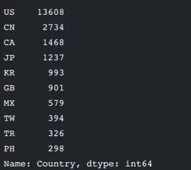
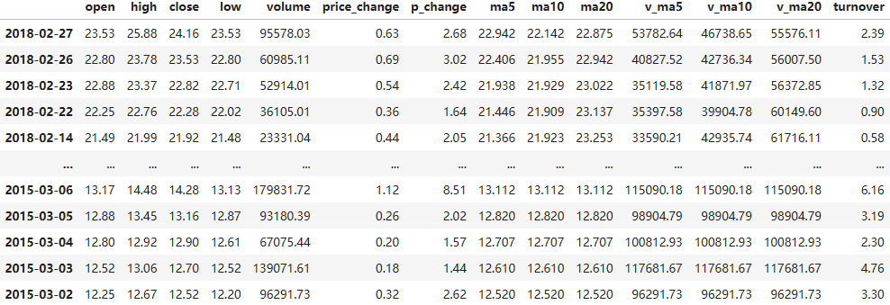
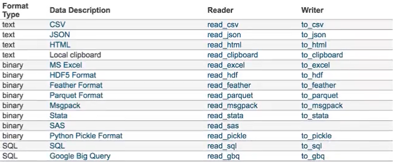
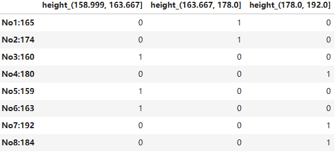
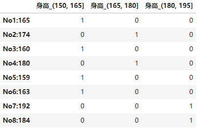

# 数据挖掘

## 1. 数据挖掘基础环境安装与使用

### 1.1 库的安装

pip install xxx==版本号

- matplotlib

- numpy

- pandas

- TA-Lib--技术指标库  

- tables--hdf5  

- jupyter--数据分析与展示的平台

> <font color="red">报错内容：ERROR: Could not build wheels for TA-Lib, which is required to install pyproject.toml-based projects）</font>
> 
> 如果Windows安装TA-Lib失败可以尝试本地手动安装:
> 
> * 打开[Archived: Python Extension Packages for Windows - Christoph Gohlke](https://www.lfd.uci.edu/~gohlke/pythonlibs/)
> 
> * 使用快捷键：ctrl+f打开搜索框 然后搜索ta-lib
> 
> * 找到python对应版本下载，比如python3.10，可以下载TA_Lib‑0.4.24‑cp310‑cp310‑win_amd64.whl
> 
> * 下载完成后将他复制到本地python目录下的script路径下
> 
> * 在此目录打开从cmd输入命令：
>   
>   * pip install TA_Lib‑0.4.24‑cp310‑cp310‑win_amd64.whl
> 
> 注意如果提示<font color="red">ERROR: TA_Lib-0.4.24-cp310-cp310-win_amd64.whl is not a supported wheel on this platform.</font>表示该文件不支持该平台，此时可以手动重命名该文件，可以使用pip debug --verbose查看平台支持的文件格式：
> 
> ```
> Compatible tags: 42
>   cp312-cp312-win_amd64
>   cp312-abi3-win_amd64
>   cp312-none-win_amd64
>   cp311-abi3-win_amd64
>   cp310-abi3-win_amd64
>   cp39-abi3-win_amd64
>   cp38-abi3-win_amd64
>   cp37-abi3-win_amd64
>   cp36-abi3-win_amd64
>   cp35-abi3-win_amd64
> ```
> 
> 把之前下载的TA_Lib‑0.4.24‑cp310‑cp310‑win_amd64.whl文件修改为TA_Lib-0.4.24-cp310-abi3-win_amd64.whl，重新安装即可：
> 
> pip install TA_Lib-0.4.24-cp310-abi3-win_amd64.whl

### 1.2 jupyter notebook使用

#### 学习目标

* 目标
  
  * 学会使用Jupyter Notebook编写运行代码

* 应用
  
  * 创建文件
  
  * 操作cell
  
  * 运行操作

* 内容预览
  
  * 1.2.1 Jupyter Notebook介绍
  
  * 1.2.2 为什么使用Jupyter Notebook？
  
  * 1.2.3 Jupyter Notebook的使用-helloworld
    
    * 1 界面启动、创建文件
    
    * 2 cell操作
    
    * 3 markdown演示

#### 1.2.1 Jupyter Notebook介绍

Project Jupyter 是一个非营利性的开源项目，诞生于 2014 年的 [IPython 项目](https://ipython.org/)，因为它发展到支持跨所有编程语言的交互式数据科学和科学计算。Jupyter 将永远是 100% 开源软件，所有人都可以免费使用，并在[修改后的 BSD 许可证](https://opensource.org/licenses/BSD-3-Clause)的自由条款下发布。

* Jupyter Notebook，原名IPython Notebook，是IPython的加强网页版，一个开源Web应用程序

* 名字源自Julia、Python和R（数据科学的三种开源语言）

* 是一款程序员和科学工作者的**编程/文档/笔记/展示**软件

* **.ipynb**文件格式是用于计算型叙述的**JSON文档格式**的正式规范


#### 1.2.2 为什么使用Jupyter Notebook？

* 传统软件开发：工程/目标明确
  
  * 需求分析，设计架构，开发模块，测试

* 数据挖掘：艺术/目标不明确
  
  * 目的是具体的洞察目标，而不是机械的完成任务
  
  * 通过执行代码来理解问题
  
  * 迭代式地改进代码来改进解决方法

实时运行的代码、叙事性的文本和可视化被整合在一起，方便使用代码和数据来讲述故事

**对比Jupyter Notebook和Pycharm**

* 画图
  
  

* 数据展示
  
  

#### 1.2.3 Jupyter Notebook的使用-helloworld

##### 1 界面启动、创建文件

环境搭建（搭建虚拟环境）好后，本机终端输入jupyter notebook（或者ipyhon notebook）命令，会自动弹出浏览器窗口打开Jupyter Notebook

```
# 输入命令
jupyter notebook
```

本地notebook的默认URL为：http://localhost:8888

想让notebook打开指定目录，只要进入目录后执行命令即可


* 新建notebook文档
  
  * notebook文档格式是.ipynb
    
    

* 内容界面操作-helloworld
  
  标题栏：点击标题（如Untitled）修改文档名 菜单栏

* 导航-File-Download as，另存为其他格式

* 导航-Kernal
  
  * Interrupt，中断代码执行（程序卡死时）
  
  * Restart，重启Python内核（执行太慢时重置全部资源）
  
  * Restart & Clear Output，重启并清除所有输出
  
  * Restart & Run All，重启并重新运行所有代码
  
  

##### 2 cell操作

什么是cell？

**cell**：一对In Out会话被视作一个代码单元，称为cell

Jupyter支持两种模式：

* 编辑模式（Enter）
  
  * 命令模式下`回车Enter`或`鼠标双击`cell进入编辑模式
  
  * 可以**操作cell内文本**或代码，剪切/复制/粘贴移动等操作

* 命令模式（Esc）
  
  * 按`Esc`或`鼠标在本单元格之外点一下`退出编辑，进入命令模式
  
  * 可以**操作cell单元本身**进行剪切/复制/粘贴/移动等操作

**1）鼠标操作**


**2）快捷键操作**

* 两种模式通用快捷键
  
  * **`Shift+Enter`，执行本单元代码，并跳转到下一单元**
  
  * **`Ctrl+Enter`，执行本单元代码，留在本单元**
  
  cell行号前的*，表示代码正在运行

* **命令模式**：按ESC进入
  
  * `Y`，cell切换到Code模式
  
  * `M`，cell切换到Markdown模式
  
  * `A`，在当前cell的上面添加cell
  
  * `B`，在当前cell的下面添加cell
  
  * `双击D`：删除当前cell
  
  * `Z`，回退
  
  * `L`，为当前cell加上行号
  
  * `Ctrl+Shift+P`，对话框输入命令直接运行
  
  * 快速跳转到首个cell，`Ctrl+Home`
  
  * 快速跳转到最后一个cell，`Ctrl+End`

* **编辑模式**：按Enter进入
  
  * 多光标操作：`Ctrl键点击鼠标`
  
  * 回退：`Ctrl+Z`
  
  * 重做：`Ctrl+Y`
  
  * 补全代码：变量、方法后跟`Tab键`
  
  * 为一行或多行代码添加/取消注释：`Ctrl+/`
  
  * 屏蔽自动输出信息：可在最后一行语句之后加一个分号

##### 3 markdown演示

掌握标题和缩进即可

## 2. Matplotlib

### 2.1 Matplotlib之HelloWorld

**学习目标**

* 目标
  
  * 快速掌握Matplotlib画图

* 应用
  
  * 无

* 内容预览
  
  * 2.1.1 什么是Matplotlib
  
  * 2.1.2 为什么要学习Matplotlib
  
  * 2.1.3 实现一个简单的Matplotlib画图
  
  * 2.1.4 认识Matplotlib图像结构
  
  * 2.1.5 拓展知识点：Matplotlib三层结构
    
    * 1 容器层
    
    * 2 辅助显示层
    
    * 3 图像层

#### 2.1.1 什么是Matplotlib


* 专门用于开发2D图表（包括3D图表）

* 使用起来及其简单

* 以渐进、交互方式实现数据可视化

#### 2.1.2 为什么要学习Matplotlib

可视化是在整个数据挖掘的关键辅助工具，可以清晰的理解数据，从而调整我们的分析方法。

- 能将数据进行可视化，更直观的呈现

- 使数据更加客观、更具说服力

例如下面两个图为数字展示和图形展示：



#### 2.1.3 实现一个简单的Matplotlib画图

```python
import matplotlib.pyplot as plt
# 第二行可以不写，有的环境需要加上这行，适配环境
%matplotlib inline
plt.figure()
plt.plot([1, 0, 9], [4, 5, 6])
plt.show()
```


#### 2.1.4 认识Matplotlib图像结构


#### 2.1.5 拓展知识点：Matplotlib三层结构

**1 容器层**

容器层主要由Canvas、Figure、 Axes组成。

Canvas是位于最底层的系统层，在绘图的过程中充当画板的角色，即放置画布(Figure)的工具。

Figure是Canvas上方的第一层，也是需要用户来操作的应用层的第一层， 在绘图的过程中充当画布的角色。

Axes是应用层的第二层，在绘图的过程中相当于画布上的绘图区的角色。

- Figure:指整个图形(可以通过plt.figure0设置画布的大小和分辨率等)

- Axes(坐标系):数据的绘图区域

- Axis(坐标轴):坐标系中的一条轴，包含大小限制、刻度和刻度标签

特点为：

* 一个figure(画布)可以包含多个axes(坐标系/绘图区)，但是一个axes只能属于一 个figure。

* 一个axes(坐标系/绘图区)可以包含多个axis(坐标轴)，包含两个即为2d坐标系，3个即为3d坐标系

**2 辅助显示层**

辅助显示层为Axes(绘图区)内的除了根据数据绘制出的图像以外的内容，主要包括Axes外观(facecolor)、边框线(spines)、坐标轴(axis)、 坐标轴名称(axis label)、坐标轴刻度(tick)、 坐标轴刻度标签(tick label)、网格线(grid)、图例(legend)、 标题(title)等内容 。

该层的设置可使图像显示更加直观更加容易被用户理解，但又不会对图像产生实质的影响。


**3 图像层**

图像层指Axes内通过plot、scatter、 bar、histogram、pie等 函数根据数据绘制出的图像。

**总结**

- Canvas (画板)( 位于最底层，用户一般接触不到

- Figure (画布)建立在Canvas之上

- Axes (绘图区)建立在Figure之上

- 坐标轴(axis) 、图例(legend) 等辅助显示层以及图像层都是建立在Axes之上

### 2.2 折线图（plot）于基本绘图功能

**学习目标**

- 目标
  
  * 知道如何解决中文显示问题
  
  * 知道matplotlib的图结构
  
  * 应用figure实现创建绘图区域大小
  
  * 应用plot实现折线图的绘制
  
  * 应用title,xlabel,ylabel实现标题以及x,y轴名设置
  
  * 应用xticks.,yticks实现axes的刻度设置和标注
  
  * 应用savefig实现图形的本地保存
  
  * 应用grid实现显示网格应用axis实现图像形状修改
  
  * 应用legend实现图形标注信息显示
  
  * 应用plt.subplots实现多坐标系的创建
  
  * 知道如何设置多个axes的标题、刻度
  
  * 知道折线图的应用场景

- 应用
  
  * 天气的温度变化显示

- 内容预览
  
  * 2.2.1折线图绘制与保存图片
    
    * 1 matplotlib.pyplot模块
    
    * 2 折线图绘制与显示
    
    * 3 设置画布属性与图片保存
  
  * 2.2.2 完善原始折线图1 (辅助显示层)
    
    * 1 准备数据并画出初始折线图
    
    * 2 添加自定义x, y刻度
    
    * 3 中文显示问题解决
    
    * 4 添加网格显示
    
    * 5 添加描述信息
  
  * 2.2.3完善原始折线图2(图像层)
    
    * 1 多次plot
    
    * 2 设置图形风格
  
  * 2.2.4 多个坐标系显示-plt.subplots(面向对象的画图方法)
  
  * 2.2.5折线图的应用场景

#### 2.2.1折线图绘制与保存图片

为了更好地理解所有基础绘图功能，我们通过天气温度变化的绘图来融合所有的基础API使用

**1 matplotlib.pyplot模块**

matplotib.pyplot包含了-系列类似于matlab的画图函数。它的函数作用 于当前图形(figure)的当前坐标系(axes)。

```python
import matplotlib.pyplot as plt
```

**2 折线图绘制与显示**

展现上海一周的天气,比如从星期一到星期日的天气温度如下

```python
# 创建画布
plt.figure()
# 绘制图像
plt.plot([1, 2, 3, 4, 5, 6, 7], [17, 17, 18, 15, 11, 11, 13])
# 显示图像
plt.show()
```


可以看到这样显示效果并不好，我们可以加入更多的功能：

**3 设置画布属性与图片保存**

```
plt.figure(figsize=(), dpi=)
    figsize:指定图的长宽
    dpi:图像的清晰度
    返回fig对象
plt.savefig(path)
```

```python
# 1 创建画布，并设置画布属性
plt.figure(figsize=(20,8), dpi=80)
# 2 绘制图像
plt.plot([1, 2, 3, 4, 5, 6, 7], [17, 17, 18, 15, 11, 11, 13])
# 3 保存图片到指定路径
plt.savefig("test78.png")
# 4 显示图片
plt.show()
```

* 注意：plt.show()会释放figure资源，如果在显示图片之后保存图片将只能保存空图片

**案例：显示温度变化状况**

需求：画出某城市11点到12点1小时内每分钟的温度变化折线图，温度范围在15度~18度

效果：


#### 2.2.2 完善原始折线图1 (辅助显示层)

**1 准备数据并画出初始折线图**


```python
import random
# 1 准备数据
x = range(60)
y_shanghai = [random.uniform(15, 18) for i in x]
# 2 创建画布
plt.figure(figsize=(20, 8), dpi=80)
# 3 绘制图像
plt.plot(x, y_shanghai)
# 4 显示图像
plt.show()
```

**2 添加自定义x, y刻度**


* plt.xticks(x, **kwargs)
  
  x:要显示的刻度值

* plt.yticks(y, **kwargs)
  
  y:要显示的刻度值

```python
import random
# 1 准备数据
x = range(60)
y_shanghai = [random.uniform(15, 18) for i in x]
# 2 创建画布
plt.figure(figsize=(20, 8), dpi=80)
# 3 绘制图像
plt.plot(x, y_shanghai)
# 修改x、y刻度
x_label = ["11点{}分".format(i) for i in x]
plt.xticks(x[::5], x_label[::5])
plt.yticks(range(0, 40, 5))
# 解决中文乱码问题
plt.rcParams['font.sans-serif'] = ['KaiTi'] 
plt.rcParams['axes.unicode_minus'] = False
# 4 显示图像
plt.show()
```

如果没有解决过中文问题的话，会显示这个样子：


**3 中文显示问题解决**

下载中文字体(黑体，看准系统版本)

* 下载SimHei字体(或者其他的支持中文显示的字体也行)

**1）安装字体**

* windows和mac下: 双击安装
  
  注意：windows下可以不用下载字体，在代码中添加
  
  ```python
  # 解决中文乱码问题
  plt.rcParams['font.sans-serif'] = ['KaiTi'] 
  plt.rcParams['axes.unicode_minus'] = False
  ```

* linux下：拷贝字体到usr/share/fonts 下：
  
  ```shell
  sudo cp ~/SimHei.ttf /usr/share/fonts/SimHei.ttf
  ```
  
  注）Linux如果用ubantu也可以通过双击安装

**2）删除matplotlib缓存文件**

Mac系统的解决方案：

* 删除~/.matplotlib中的缓存文件
  
  ```shell
  cd ~/.matplotlib
  rm -r *
  ```

Linux系统解决方案

* 删除~/.cache/matplotlib中的缓存文件
  
  ```shell
  cd ~/.cache/matplotlib
  rm -r *
  ```

**3）修改配置文件matplotlib**

Mac系统的解决方案：

* 修改配置文件matplotlibrc
  
  ```shell
  vi ~/.matplotlib/matplotlibrc
  ```
  
  将文件内容修改为：
  
  ```vim
  font.family    : sans-serif
  font.sans-serif    : SimHei
  axes.unicode_minus    : False
  ```

Linux系统解决方案

* 修改配置文件
  
  ```shell
  sudo find -name matplotlibrc
  ```
  
  返回结果
  
  ```shell
  ./.virtualenvs/ai/lib/python3.5/site-packages/matplotlib/mpl-data/matplotlibrc
  ```
  
  打开配置文件
  
  ```shell
  vi ./.virtualenvs/ai/lib/python3.5/site-packages/matplotlib/mpl-data/matplotlibrc
  ```
  
  将配置文件中下面3项改为如下所示：
  
  ```vim
  font.family    : sans-serif
  font.sans-serif    : SimHei
  axes.unicode_minus    : False
  ```

**4 添加网格显示**

为了更加清楚地观察图形对应的值


```python
plt.grid(True, linestyle='--', alpha=0.5)
```

**5 添加描述信息**

添加x轴、y轴描述信息及标题


```python
plt.xlabel("时间")
plt.ylabel("温度")
plt.title("中午11点0分到12点之间的温度变化图示")
```

#### 2.2.3完善原始折线图2(图像层)

**需求:再添加一个城市的温度变化**

收集到北京当天温度变化情况，温度在1度到3度。


**1 多次plot**

怎么去添加另一个在同一坐标系当中的不同图形，其实很简单只需要再次plot即可，但是需要区分线条，如下显示

```python
import random
# 1 准备数据
x = range(60)
y_shanghai = [random.uniform(15, 18) for i in x]
# 准备北京的数据
y_beijing = [random.uniform(1, 3) for i in x]
# 2 创建画布
plt.figure(figsize=(20, 8), dpi=80)
# 3 绘制图像
plt.plot(x, y_shanghai, label='上海')
plt.plot(x, y_beijing, color='orange', linestyle='--', label='北京')
# 显示图例
plt.legend()
# 修改x、y刻度
x_label = ["11点{}分".format(i) for i in x]
plt.xticks(x[::5], x_label[::5])
plt.yticks(range(0, 40, 5))
# 解决中文乱码问题
plt.rcParams['font.sans-serif'] = ['KaiTi'] 
plt.rcParams['axes.unicode_minus'] = False
# 添加网格显示
plt.grid(True, linestyle='--', alpha=0.5)
# 添加描述信息
plt.xlabel("时间")
plt.ylabel("温度")
plt.title("中午11点0分到12点之间的温度变化图示")
# 4 显示图像
plt.show()
```

我们仔细观察，用到了两个新的地方，一个是对于不同的折线展示效果，一个是添加图例。

**2 设置图形风格**


**显示图例**

* 注意：如果只在plt.plot0中设 置label还不能最终显示出图例，还需要通过plt.legend（）将图例显示出来。
  
  ```python
  plt.legend(loc="best")
  ```


完整代码：

```python
import random
# 1 准备数据
x = range(60)
y_shanghai = [random.uniform(15, 18) for i in x]
# 准备北京的数据
y_beijing = [random.uniform(1, 3) for i in x]
# 2 创建画布
plt.figure(figsize=(20, 8), dpi=80)
# 3 绘制图像
plt.plot(x, y_shanghai, label='上海')
plt.plot(x, y_beijing, color='orange', linestyle='--', label='北京')
# 显示图例
plt.legend(loc='best')
# 修改x、y刻度
x_label = ["11点{}分".format(i) for i in x]
plt.xticks(x[::5], x_label[::5])
plt.yticks(range(0, 40, 5))
# 解决中文乱码问题
plt.rcParams['font.sans-serif'] = ['KaiTi'] 
plt.rcParams['axes.unicode_minus'] = False
# 添加网格显示
plt.grid(True, linestyle='--', alpha=0.5)
# 添加描述信息
plt.xlabel("时间")
plt.ylabel("温度")
plt.title("中午11点0分到12点之间的温度变化图示")
# 4 显示图像
plt.show()
```

#### 2.2.4 多个坐标系显示-plt.subplots(面向对象的画图方法)

如果我们想要将上海和北京的天气图显示在同一个图的不同坐标系当中，效果如下：


可以通过subplots函数实现(旧的版本中有subplot,使用起来不方便)，推荐subplots函数

* matplotlib.pyplot.subplots(nrows=1, ncols=1, **fig_.kw) 创建一个带有 多个axes(坐标系/绘图区)的图

> Parameters:
> 
> nrows, ncols : int, optional, default: 1, Number of rows/columns of the subplot grid.
> **fig_kw : All additional keyword arguments are passed to the figure() call.
> 
> Returns:
> fig：图对象
> ax：
> 
>     设置标题等方法不同:
>     set_xticks
>     set_yticks
>     set_xlabel
>     set_ylabel

  关于axes子坐标系的更多方法：参考[matplotlib.axes &#8212; Matplotlib 3.8.2 documentation](https://matplotlib.org/stable/api/axes_api.html)

* 注意：plt.函数名()相当于面向过程的画图方法，axes.set 方法名()相当于面向对象的画图方法。

#### 2.2.5折线图的应用场景

- 呈现公司产品(不同区域)每天活跃用户数

- 呈现app每天下载数量

- 呈现产品新功能上线后,用户点击次数随时间的变化

- 拓展:画各种数学函数图像
  
  * 注意: plt.plot()除了可以画折线图，也可以用于画各种数学函数图像
    
    
    
    代码
    
    ```python
    import numpy as np
    import matplotlib.pyplot as plt
    # 准备数据
    x = np.linspace(-10, 10, 1000)
    y = np.sin(x)
    # 创建画布
    plt.figure(figsize=(20, 8), dpi=100)
    # 绘制函数图像
    plt.plot(x, y)
    # 添加网格
    plt.grid()
    # 显示图像
    plt.show()
    ```

**小结**

开头的这几个目标应用全都很重要

- 知道如何解决中文显示问题

- 知道matplotlib的图结构

- 应用figure实现创建绘图区域大小

- 应用plot实现折线图的绘制

- 应用title,xlabel,ylabel实 现标题以及x,y轴名设置

- 应用xticks,yticks实现axes的刻度设 置和标注

- 应用savefig实现图形的本地保存

- 应用grid实现显示网格应用axis实现图像形状修改

- 应用legend实现图形标注信息显示

- 应用plt.subplots实现 多坐标系的创建

- 知道如何设置多个axes的标题、刻度

### 2.3 散点图（scatter）

**学习目标**

* 目标
  
  * 掌握常见统计图及其意义
  
  * 绘制散点图

* 应用
  
  * 探究不同变量之间的关系

* 内容预览
  
  * 2.3.1 常见图形种类及意义
  
  * 2.3.2 散点图绘制
  
  * 2.3.3 散点图应用场景

Matplotlib能够绘制**折线图、散点图、柱状图、直方图、饼图**。

我们需要知道不同的统计图的意义，以此来决定选择哪种统计图来呈现我们的数据。

#### 2.3.1 常见图形种类及意义

* 折线图：以折线的上升或下降来表示统计数量的增减变化的统计图
  
  **特点：能够显示数据的变化趋势，反映事物的变化情况。(变化)**
  
  

* 散点图：用两组数据构成多个坐标点，考察坐标点的分布,判断两变量之间是否存在某种关联或总结坐标点的分布模式。
  
  **特点：判断变量之间是否存在数量关联趋势,展示离群点(分布规律)**
  
  

* 柱状图：排列在工作表的列或行中的数据可以绘制到柱状图中。
  
  **特点：绘制连离散的数据,能够一眼看出各个数据的大小,比较数据之间的差别。(统计/对比)**
  
  

* 直方图：由一系列高度不等的纵向条纹或线段表示数据分布的情况。一般用横轴表示数据范围，纵轴表示分布情况。
  
  **特点：绘制连续性的数据展示一组或者多组数据的分布状况(统计)**
  
  

* 饼图：用于表示不同分类的占比情况，通过弧度大小来对比各种分类。
  
  **特点：分类数据的占比情况(占比)**
  
  

#### 2.3.2 散点图绘制

需求：探究房屋面积和房屋价格的关系

房屋面积数据：

```
x = [225.98, 247.07, 253.14, 457.85, 241.58, 301.01, 20.67, 288.64, 
163.56, 120.06, 207.83, 342.75, 147.9, 53.06, 224.72, 29.51,21.61, 
483.21, 245.25, 399.25, 343.35]
```

房屋价格数据：

```
y = [196.63, 203.88, 210.75, 372.74, 202.41, 247.61, 24.9, 239.34,
140.32, 104.15, 176.84, 288.23, 128.79, 49.64, 191.74, 33.1 ,30.74,
400.02, 205.35, 330.64, 283.45]
```


代码

```python
# 需求：探究房屋面积和房屋价格的关系
import matplotlib.pyplot as plt
# 1 准备数据
x = [225.98, 247.07, 253.14, 457.85, 241.58, 301.01, 20.67, 288.64, 
     163.56, 120.06, 207.83, 342.75, 147.9, 53.06, 224.72, 29.51,21.61, 
     483.21, 245.25, 399.25, 343.35]
y = [196.63, 203.88, 210.75, 372.74, 202.41, 247.61, 24.9, 239.34,
     140.32, 104.15, 176.84, 288.23, 128.79, 49.64, 191.74, 33.1 ,30.74,
     400.02, 205.35, 330.64, 283.45]
# 2 创建画布
plt.figure(figsize=(20, 8), dpi=100)
# 3 绘制图像
plt.scatter(x, y)
# 4 显示图像
plt.show()
```

#### 2.3.3 散点图应用场景

* 探究不同变量之间的内在关系

### 2.4 柱状图（bar）

**学习目标**

* 目标
  
  * 应用bar实现柱状图的绘制
  
  * 知道柱状图的应用场景

* 应用
  
  * 电影票房收入绘制

* 内容预览
  
  * 2.4.1 柱状图绘制
  
  * 2.4.2 柱状图应用场景

#### 2.4.1 柱状图绘制


**需求1-对比每部电影的票房收入**


电影数据如下图所示：


1 准备数据

```python
['雷神3:诸神黄昏', '正义联盟', '东方快车谋杀案', '寻梦环游记', '全球风暴', '降魔传', '追捕', '七十七天', '密战', '狂兽', '其他']
[73853, 57767, 22354, 15969, 14839, 8725, 8716, 8318, 7916, 6764, 52222]
```

2  绘制

* matplotlib.pyplot.bar(x, width, align='center', **kwargs)
  
  绘制柱状图
  
  > Parameters:
  > x : sequence of scalars.
  > 
  > width : scalar or array-like, optional
  > 柱状图的宽度
  > 
  > align : {'center', 'edge'}, optional, default: ' center'
  > Alignment of the bars to the x coordinates:
  > 'center': Center the base on the x positions.
  > 'edge': Align the left edges of the bars with the x positions.
  > 每个柱状图的位置对齐方式
  > 
  > **kwargs :
  > color:选择柱状图的颜色
  > 
  > Returns:
  > `. BarContainer`
  > Container with all the bars and optionally errorbars.
  
  代码
  
  ```python
  import matplotlib.pyplot as plt
  # 准备数据
  movie_names = ['雷神3:诸神黄昏', '正义联盟', '东方快车谋杀案', '寻梦环游记', '全球风暴', '降魔传', '追捕', '七十七天', '密战', '狂兽', '其他']
  tickets = [73853, 57767, 22354, 15969, 14839, 8725, 8716, 8318, 7916, 6764, 52222]
  # 2 创建画布
  plt.figure(figsize=(20, 8), dpi=100)
  # 3 绘制柱状图
  x_ticks = range(len(movie_names))
  plt.bar(x_ticks, tickets, color=['b','r','y','c','m','y','k','c','g','b'])
  # 修改x刻度
  plt.xticks(x_ticks, movie_names)
  # 添加标题
  plt.title("电影票房收入对比")
  # 添加网格显示
  plt.grid(linestyle='--', alpha=0.5)
  # 4 显示图像
  plt.show()
  ```

**需求2-如何对比电影票房收入才更能加有说服力?**

比较相同天数的票房

有时候为了公平起见，我们需要对比不同电影首日和首周的票房

效果如下:


1 准备数据

> movie_ name = ['雷神3: 诸神黄昏', '正义联盟', '寻梦环游记']
> first_day = [10587.6, 10062.5, 1275.7]
> first_weekend= [36224.9, 34479.6, 11830]
> 
> 数据来源: [票房](https://piaofang.maoyan.com/?ver=normal)

2 绘制

* 添加首日首周两部分的柱状图

* x轴中文坐标位置调整

代码

```python
import random
import matplotlib.pyplot as plt
# 准备数据
movie_names = ['雷神3: 诸神黄昏', '正义联盟', '寻梦环游记']
first_day = [10587.6, 10062.5, 1275.7]
first_weekend= [36224.9, 34479.6, 11830]
# 2 创建画布
plt.figure(figsize=(20, 8), dpi=100)
# 3 绘制柱状图
x = range(len(movie_names))
first_day_ticks = [i-0.1 for i in x]
first_weekend_ticks = [i+0.1 for i in x]
plt.bar(first_day_ticks, first_day, width=0.2, color='b', label='首日')
plt.bar(first_weekend_ticks, first_weekend, width=0.2, color='orange', label='首周')
# 修改x刻度
plt.xticks(x, movie_names)
# 添加标题
plt.title("电影票房收入对比")
# 添加网格显示
plt.grid(linestyle='--', alpha=0.5)
# 显示图例
plt.legend(loc='best')
# 4 显示图像
plt.show()
```

#### 2.4.2 柱状图应用场景

适合用在分类数据对比场景上

- 数量统计

- 用户数量对比分析

### 2.5 直方图（histogram）

**学习目标**

- 目标
  
  * 应用hist实现直方图的绘制
  
  * 知道直方图图的应用场景
* 应用
  
  电影时长分布
- 内容预览
  
  * 2.5.1 直方图介绍
  
  * 2.5.2 直方图与柱状图的对比
  
  * 2.5.3 直方图绘制
  
  * 2.5.4 直方图的应用场景

#### 2.5.1 直方图介绍

直方图，形状类似柱状图却有着与柱状图完全不同的含义。直方图牵涉统计学的概念，首先要对数据进行分组，然后统计每个分组内数据元的数量。在坐标系中，横轴标出每个组的端点，纵轴表示频数，每个矩形的高代表对应的频数，称这样的统计图为频数分布直方图。

示例：

某校初三(1) 班36位同学的身高的频数分布直方图如下图所示：


（1）身高在哪一组的同学最多?

（2）身高在160.5cm以上的同学有多少人?

**相关概念：**

- 组数：在统计数据时，我们把数据按照不同的范围分成几个组，分成的组的个数称为组数

- 组距：每一组两个端点的差

#### 2.5.2 直方图与柱状图的对比


1. 柱状图是以矩形的长度表示每一组的频数或数量，其宽度(表示类别则是固定的，**利于较小的数据集分析**。

2. 直方图描述的是一组数据的频次分布，是以矩形的长度表示每一组的频数或数量， 宽度则表示各组的组距，因此其高度与宽度均有意义，利于**展示大量数据集的统计结果**。例如把年龄分成“0-5, 5-10, ......, 80-85“17个组，统计一下中国人口年龄的分布情况。**直方图有助于我们知道数据的分布情况，诸如众数、中位数的大致位置、数据是否存在缺口或者异常值**。
   
   **1.直方图展示数据的分布，柱状图比较数据的大小。**
   
   这是直方图与柱状图**最根本的区别**。举个例子，有10个苹果，每个苹果重量不同。如果使用直方图，就展示了重量在0-10g的苹果有多少个，10-20g的苹 果有多少个；如果使用柱状图，则展示每个苹果的具体重量。
   
   所以直方图展示的是-组数据中，在你划分的区间里，这些数据的**分布**情况，但是我们不知道在一个区间里，单个数据的具体大小。上图展现了游客在博物馆的游览时间，其中，将近40%的游客仅逗留了0-10分钟。但是我们无法知道这些游客中，每个人具体的游览时间是多少。
   
   
   
   而在柱状图里，我们能看到的是每个数据的大小，并且进行比较。下图就比较了在12次展览中，参观者参观时间的中位数，我们能够知道参观的具体用时。
   
   
   
   **2.直方图X轴为定量数据，柱状图X轴为分类数据。**
   
   在直方图中，X轴上的变量是-个个连续的区间，这些区间通常表现为数字，例如代表苹果重量的“0-10g，10-20g......“代表时间长度的“0-10min, 10-20i......”。而在柱状图中，X轴上的变量是一个个分类数据，例如不同的国家名称、不同的游戏类型。
   
   
   
   直方图上的每根柱子都是**不可移动的**，X轴.上的区间是连续的、固定的。而柱状图上的每根柱子是可以随意排序的，有的情况下需要按照分类数据的名称排列，有的则需要按照数值的大小排列。
   
   **3. 直方图柱子无间隔，柱状图柱子有间隔**
   
   因为直方图中的区间是连续的，因此柱子之间**不存在间隙**。而柱状图的柱子之间是存在间隔。
   
   **4. 直方图柱子宽度可不一，柱状图柱子宽度须一致**
   
   柱状图柱子的宽度因为没有数值含义，所以宽度必须一致。但是在直方图中，柱子的宽度代表了区间的长度，根据区间的不同，柱子的宽度可以不同，但理论上应为单位长度的倍数。
   例如，美国人口普查局(The U.S. Census Bureau)调查了12.4亿人的上班通勤时间，由于通勤时间在45-150分钟的人数太少，因此区间改为45-60分钟、60-90分钟、90-150分钟，其他组距则均为5。
   
   
   
   可以看到，Y轴的数据为“人数/组距”，在这种情况下，每个柱子的面积相加就等于调查的总人数，柱子的面积就有了意义。
   
   
   
   当上图的Y轴表达的是“区间人数/总人数/组距”，这个直方图就是我们初中学习的“频率分布直方图”，频率指的是“区间数量/总数量”。在这样的直方图中，所有柱子的面积相加就等于1啦。
   
   

#### 2.5.3 直方图绘制

**需求：电影时长分布状况**
现有250部电影的时长，希望统计出这些电影时长的分布状态(比如时长为100分钟到120分钟电影的数量，出现的频率)等信息，你应该如何呈现这些数据?

数据:

```python
time = [131, 98, 125, 131, 124, 139, 131, 117, 128, 108, 135, 138, 131, 102, 107, 114, 119, 128, 121, 142, 127, 130, 124, 101, 110, 116, 117, 110, 128, 128, 115, 99, 136, 126, 134, 95, 138, 117, 111,78, 132, 124, 113, 150, 110, 117, 86, 95, 144, 105, 126, 130,126, 130, 126, 116, 123, 106, 112, 138, 123, 86, 101, 99, 136,123, 117, 119, 105, 137, 123, 128, 125, 104, 109, 134, 125, 127,105, 120, 107, 129, 116, 108, 132, 103, 136, 118, 102, 120, 114,105, 115, 132, 145, 119, 121, 112, 139, 125, 138, 109, 132, 134,156, 106, 117, 127, 144, 139, 139, 119, 140, 83, 110, 102,123,107, 143, 115, 136, 118, 139, 123, 112, 118, 125, 109, 119, 133,112, 114, 122, 109, 106, 123, 116, 131, 127, 115, 118, 112, 135,115, 146, 137, 116, 103, 144, 83, 123, 111, 110, 111, 100, 154,136, 100, 118, 119, 133, 134, 106, 129, 126, 110, 111, 109, 141,120, 117, 106, 149, 122, 122, 110, 118, 127, 121, 114, 125, 126,114, 140, 103, 130, 141, 117, 106, 114, 121, 114, 133, 137, 92,121, 112, 146, 97, 137, 105, 98, 117, 112, 81, 97, 139, 113,134, 106, 144, 110, 137, 137, 111, 104, 117, 100, 111, 101, 110,105, 129, 137, 112, 120, 113, 133, 112, 83, 94, 146, 133, 101,131, 116, 111, 84, 137, 115, 122, 106, 144, 109, 123, 116, 111,111, 133, 150]
```

效果：


**1 直方图绘制api**

matplotlib.pyplot.hist(x.bins=None, density=None, **kwargs)

> Parameters:
> x : (n,) array or sequence of (n,) arrays
> 
> bins : integer or sequence or ' auto', optional
> 组数
> 
> density: Boolean
> 
> 是否显示频率

**2 绘制**

- 设置组距

- 设置组数(通常对于数据较少的情况，分为5~12组，数据较多，更换图形显示方式)
  
  * 通常设置组数会有相应公式:组数=极差/组距=(max-min)/bins

代码：

```python
import matplotlib.pyplot as plt
# 准备数据
time = [131,  98, 125, 131, 124, 139, 131, 117, 128, 108, 135, 138, 131, 102, 107, 114, 119, 128, 121, 142, 127, 130, 124, 101, 110, 116, 117, 110, 128, 128, 115,  99, 136, 126, 134,  95, 138, 117, 111,78, 132, 124, 113, 150, 110, 117,  86,  95, 144, 105, 126, 130,126, 130, 126, 116, 123, 106, 112, 138, 123,  86, 101,  99, 136,123, 117, 119, 105, 137, 123, 128, 125, 104, 109, 134, 125, 127,105, 120, 107, 129, 116, 108, 132, 103, 136, 118, 102, 120, 114,105, 115, 132, 145, 119, 121, 112, 139, 125, 138, 109, 132, 134,156, 106, 117, 127, 144, 139, 139, 119, 140,  83, 110, 102,123,107, 143, 115, 136, 118, 139, 123, 112, 118, 125, 109, 119, 133,112, 114, 122, 109, 106, 123, 116, 131, 127, 115, 118, 112, 135,115, 146, 137, 116, 103, 144,  83, 123, 111, 110, 111, 100, 154,136, 100, 118, 119, 133, 134, 106, 129, 126, 110, 111, 109, 141,120, 117, 106, 149, 122, 122, 110, 118, 127, 121, 114, 125, 126,114, 140, 103, 130, 141, 117, 106, 114, 121, 114, 133, 137,  92,121, 112, 146,  97, 137, 105,  98, 117, 112,  81,  97, 139, 113,134, 106, 144, 110, 137, 137, 111, 104, 117, 100, 111, 101, 110,105, 129, 137, 112, 120, 113, 133, 112,  83,  94, 146, 133, 101,131, 116, 111,  84, 137, 115, 122, 106, 144, 109, 123, 116, 111,111, 133, 150]
# 创建画布
plt.figure(figsize=(20, 8), dpi=100)
# 绘制直方图
distinct = 2
group_num = int((max(time) - min(time)) / distinct)
plt.hist(time, group_num)
# 修改x轴刻度
plt.xticks(range(min(time), max(time) + 2, distinct))
# 添加网格
plt.grid(linestyle="--", alpha=0.5)
plt.xlabel("电影时长大小")
plt.ylabel("电影的数据量")
# 显示图像
plt.show()
```

**3 直方图注意点**

1 注意组距

组距会影响直方图呈现出来的数据分布，因此在绘制直方图的时候需要多次尝试改变组距。


2 注意Y轴所代表的变量

Y轴上的变量可以是频次(数据出现了多少次)、频率(频次/总次数)、频率/组距，不同的变量会让直方图描述的数据分布意义不同。

#### 2.5.4 直方图的应用场景

- 用于表示分布情况

- 通过直方图还可以观察和估计哪些数据比较集中，异常或者孤立的数据分布在何处

例如:用户年龄分布，商品价格分布

### 2.6 饼图（pie）

**学习目标**

- 目标
  
  * 应用pie实 现饼图的绘制
  
  * 知道饼图的应用场景

- 应用
  
  * 显示不同的电影的排片占比

- 内容预览
  
  * 2.6.1饼图介绍
  
  * 2.6.2饼图绘制
  
  * 2.6.3 饼图应用场景

#### 2.6.1饼图介绍

饼图广泛得应用在各个领域，用于表示不同分类的占比情况，通过弧度大小来对比各种分类。饼图通过将一个圆饼按照分类的占比划分成多个区块，整个圆饼代表数据的总量，每个区块(圆弧)表示该分类占总体的比例大小，所有区块(圆弧)的加和等于100%。


#### 2.6.2饼图绘制

**需求：显示不同的电影的排片占比**

电影排名：


效果：


数据：

```python
movie_name = ['雷神3：诸神黄昏','正义联盟','东方快车谋杀案','寻梦环游记','全球风暴','降魔传','追捕','七十七天','密战','狂兽','其它']

place_count = [60605,54546,45819,28243,13270,9945,7679,6799,6101,4621,20105]
```

**饼图Api介绍**

- 注意显示的百分比的位数

- plt.pie(x, labels=,autopct=,colors)
  
  * x:数量， 自动算百分比
  
  * labels:每 部分名称
  
  * autopct: 占比显示指定%1.2f% %
  
  * colors:每部分颜色

代码：

```python
import matplotlib.pyplot as plt
# 准备数据
movie_name = ['雷神3：诸神黄昏','正义联盟','东方快车谋杀案','寻梦环游记','全球风暴','降魔传','追捕','七十七天','密战','狂兽','其它']
place_count = [60605,54546,45819,28243,13270,9945,7679,6799,6101,4621,20105]
# 创建画布
plt.figure(figsize=(20, 8), dpi=100)
# 绘制饼图
plt.pie(place_count, labels=movie_name,colors=['b','r','g','y','c','m','y','k','c','g','y'], autopct="%1.2f%%")
plt.axis('equal')
# 添加图例
plt.legend()
# 显示图像
plt.show()
```

**添加axis**
为了让显示的饼图保持圆形，需要添加axis保证长宽一样

#### 2.6.3 饼图应用场景

* 分类的占比情况(不超过9个分类)

例如:班级男女分布占比，公司销售额占比

### 2.7 总结


## 3. Numpy

### 3.1 Numpy优势

**学习目标**

* 目标
  
  * 了解Numpy运算速度上的优势
  
  * 知道Numpy的数组内存块风格
  
  * 知道Numpy的并行化运算

* 应用
  
  * 机器学习，深度学习各种框架的基础库

* 内容预览
  
  * 3.1.1 Numpy介绍
  
  * 3.1.2 ndarray介绍
  
  * 3.1.3 ndarray与Python原生list运算效率对比
  
  * 3.1.4 ndarray的优势

#### 3.1.1 Numpy介绍


Numpy (Numerical Python)是一个开源的Python科学计算库，用于快速处理任意维度的数组。Numpy支持常见的数组和矩阵操作。对于同样的数值计算任务，使用Numpy比直接使用Python要简洁的多。

Numpy使用ndarray对象来处理多维数组，该对象是一个快速而 灵活的大数据容器。

NumPy 是 Python 中用于科学计算的基础包。这是一个 Python 库，提供多维数组对象，各种派生 对象（例如掩码数组和矩阵），以及各种例程 对数组的快速操作，包括数学、逻辑、形状操作、 排序、选择、I/O、离散傅里叶变换、基本线性代数、 基本统计运算、随机模拟等等。

#### 3.1.2 ndarray介绍

NumPy提供了一个**N维数组类型ndarray**，它描述了**相同类型**的"items"的集合。


用ndarray进行存储：

```python
import numpy as np
score = np.array([[80, 89, 86, 67, 79],
[78, 97, 89, 67, 81],
[90, 94, 78, 67, 74],
[91, 91, 90, 67, 69],
[76, 87, 75, 67, 86],
[70, 79, 84, 67, 84],
[94, 92, 93, 67, 64],
[86, 85, 83, 67, 80]])
```

返回结果：

```python
score
array([[80, 89, 86, 67, 79],
       [78, 97, 89, 67, 81],
       [90, 94, 78, 67, 74],
       [91, 91, 90, 67, 69],
       [76, 87, 75, 67, 86],
       [70, 79, 84, 67, 84],
       [94, 92, 93, 67, 64],
       [86, 85, 83, 67, 80]])
type(score)
numpy.ndarray
```

使用Python列表可以存储一维数组，通过列表的嵌套可以实现多维数组，那么为什么还需要使用Numpy的ndarray呢?

#### 3.1.3 ndarray与Python原生list运算效率对比

在这里我们通过一段代码运行来体会到ndarray的好处

```python
import random
import time
import numpy as np
# 生成一个大数组
python_list = []
for i in range(100000000):
    python_list.append(random.random())
ndarray_list = np.array(python_list)
# 原生pythonList求和
t1 = time.time()
a = sum(python_list)
t2 = time.time()
d1 = t2 - t1;
# ndarray求和
t3 = time.time()
b = np.sum(ndarray_list)
t4 = time.time()
d2 = t4 - t3;
print(d1, d2)
```

t2-t1为使用python自带的求和函数消耗的时间，t5-t3为使用numpy求和消耗的时间，结果为:


从中我们看到ndarray的计算速度要快很多，节约了时间。

**机器学习的最大特点就是大量的数据运算**，那么如果没有-个快速的解决方案,那可能现在python也在机器学习领域达不到好的效果。


Numpy专门针对ndarray的操作和运算进行了设计，所以数组的存储效率和输入输出性能远优于Python中的嵌套列表，数组越大，Numpy的优势就趣明显。

**思考: ndarray为什么可以这么快?**

#### 3.1.4 ndarray的优势

**1 内存块风格**

ndarray到底跟原生python列表有什么不同呢，请看一张图：


从图中我们可以看出ndarray在存储数据的时候，数据与数据的地址都是连续的，这样就给使得批量操作数组元素时速度更快。

这是因为ndarray中的所有元素的类型都是相同的，而Python列表 中的元素类型是任意的，所以ndarray在存储元素时内存可以连续，而python原生lis就t只能通过 寻址方式找到下一个元素，这虽然也导致了在通用性能方面Numpy的ndarray不及Python原生list,但在科学计算中，Numpy的ndarray就可 以省掉很多循环语句，代码使用方面比Python原生list简单的多。

**2 ndarray支持并行化运算（向量化运算）**

**3 Numpy底层使用C语言编写，内部解除了GIL（全局解释器锁），其对数组的操作不受Python解释器的限制，效率远高于纯Python代码**

### 3.2 认识N维数组-ndarray属性

**学习目标**

- 目标
  
  * 说明数组的属性，形状、类型.
* 应用
  
  * 无
- 内容预览
  
  * 3.2.1 ndarray的属性
  
  * 3.2.2 ndarray的形状
  
  * 3.2.3 ndarray的类型
  
  * 3.2.4 总结

#### 3.2.1 ndarray的属性

数组属性反映了数组本身固有的信息。


#### 3.2.2 ndarray的形状

首先创建一些数组：

```python
import numpy as np
a = np.array([[1,2,3],[4,5,6]])   #(2,3)  
b = np.array([1,2,3,4])               #(4,) 
c = np.array([[[1,2,3],[4,5,6]],[[1,2,3],[4,5,6]]])#(2,2,3)
```

分别打印出形状

```python
a.shape
(2, 3) # 二维数组
b.shape
(4,) # 一维数组
c.shape
(2, 2, 3) # 三维数组
```

如何理解数组的形状?

二维数组：


三维数组：


#### 3.2.3 ndarray的类型

```python
type(score) # numpy.ndarray
type(score.dtype) # numpy.dtypes.Int32DType
```

dtype是numpy.dtypes.Int32DType类型，先看看对于数组来说都有哪些类型


默认数据类型：

| 数据格式 | 默认数据类型           |
| ---- | ---------------- |
| 整形   | dtype('int32')   |
| 浮点型  | dtype('float64') |

**创建数组的时候指定类型**

```python
d = np.array([1.1,2.2,3.3,4.4], dtype=np.float32)
# d = np.array([1.1,2.2,3.3,4.4], dtype="float32")
d.dtype # dtype('float32')
```

* 注意：若不指定，整数默认int32，小数默认float64

#### 3.2.4 总结

知道数组的基本属性，不同形状的维度表示以及数组的类型

### 3.3 基本操作

**学习目标**

* 目标
  
  * 理解数组的各种生成方法
  
  * 应用数组的索引机制实现数组的切片获取
  
  * 应用维度变换实现数组的形状改变
  
  * 应用类型变换实现数组类型改变
  
  * 应用数组的转换

* 应用
  
  * 应用正态分布实现模拟股票的涨跌幅数据操作

* 内容预览
  
  * 3.3.1 生成数组的方法
    
    * 1 生成0和1的数组
    
    * 2 从现有数组生成
    
    * 3 生成固定范围的数组
    
    * 4 生成随机数组
  
  * 3.3.2 数组的索引、切片
  
  * 3.3.3 形状修改
  
  * 3.3.4 类型修改
  
  * 3.3.5 数组的去重
  
  * 3.3.6 小结

#### 3.3.1 生成数组的方法

##### 1 生成0和1的数组

- empty(shape[, dtype, order) empty. like(a[, dtype, order, subok])

- eye(N[, M, k, dtype, order])

- identity(n[, dtype])

- **ones(shape[, dtype, order])**

- ones_ like(a[, dtype, order, subok])

- **zeros(shape[, dtype, order]) zeros_ like(a[, dtype, order, subok])**

- full(shape, fll_ value[, dtype, order])

- full like(a, fil _value[, dtype, order, subok])

```python
a = np.zeros(shape = (3, 4), dtype=np.float32 )
array([[0., 0., 0., 0.],
       [0., 0., 0., 0.],
       [0., 0., 0., 0.]], dtype=float32)
np.ones(shape=[2, 3], dtype="int64")
array([[1, 1, 1],
       [1, 1, 1]], dtype=int64)
```

##### 2 从现有数组生成

- **array(object[, dtype, copy, order, subok, ndmin])**--深拷贝

- **asarray(a[, dtype, order])**--浅拷贝

- asanyarray(a[, dtype, order]) ascontiguousarray(a[, dtype])

- asmatrix(data[, dtype])

- **copy(a[, order])**--深拷贝

```python
import numpy as np
score = np.array([[80, 89, 86, 67, 79],
[78, 97, 89, 67, 81],
[90, 94, 78, 67, 74],
[91, 91, 90, 67, 69],
[76, 87, 75, 67, 86],
[70, 79, 84, 67, 84],
[94, 92, 93, 67, 64],
[86, 85, 83, 67, 80]])
data1 = np.array(score) # 深拷贝
data2 = np.asarray(score) # 浅拷贝，相当于索引形式，没有创建新的数组
data3 = np.copy(score) # 深拷贝
```

**关于array和asarray的不同**

```python
import numpy as np
score = np.array([[80, 89, 86, 67, 79],
[78, 97, 89, 67, 81],
[90, 94, 78, 67, 74],
[91, 91, 90, 67, 69],
[76, 87, 75, 67, 86],
[70, 79, 84, 67, 84],
[94, 92, 93, 67, 64],
[86, 85, 83, 67, 80]])
data1 = np.array(score) # 深拷贝
data2 = np.asarray(score) # 浅拷贝，相当于索引形式，没有创建新的数组
data3 = np.copy(score) # 深拷贝
# 修改原数组score的第4行2列值为10000
score[3, 1] = 10000
# 结果
array([[   80,    89,    86,    67,    79],
       [   78,    97,    89,    67,    81],
       [   90,    94,    78,    67,    74],
       [   91, 10000,    90,    67,    69],
       [   76,    87,    75,    67,    86],
       [   70,    79,    84,    67,    84],
       [   94,    92,    93,    67,    64],
       [   86,    85,    83,    67,  80]])
# 拷贝之后数组变化
data1
array([[80, 89, 86, 67, 79],
       [78, 97, 89, 67, 81],
       [90, 94, 78, 67, 74],
       [91, 91, 90, 67, 69],
       [76, 87, 75, 67, 86],
       [70, 79, 84, 67, 84],
       [94, 92, 93, 67, 64],
       [86, 85, 83, 67, 80]])
data2
array([[   80,    89,    86,    67,    79],
       [   78,    97,    89,    67,    81],
       [   90,    94,    78,    67,    74],
       [   91, 10000,    90,    67,    69],
       [   76,    87,    75,    67,    86],
       [   70,    79,    84,    67,    84],
       [   94,    92,    93,    67,    64],
       [   86,    85,    83,    67,    80]])
data3
array([[80, 89, 86, 67, 79],
       [78, 97, 89, 67, 81],
       [90, 94, 78, 67, 74],
       [91, 91, 90, 67, 69],
       [76, 87, 75, 67, 86],
       [70, 79, 84, 67, 84],
       [94, 92, 93, 67, 64],
       [86, 85, 83, 67, 80]])
```

##### 3 生成固定范围的数组

* np.linspace (start, stop, num, endpoint, retstep, dtype)

生成等间隔的序列

> start序列的起始值
> stop序列的终止值
> 如果endpoint为true,该值包含于序列中
> num要生成的等间隔样例数量，默认为50
> endpoint序列中是否包含stop值，默认为ture
> retstep如果为true,返回样例，
> 以及连续数字之间的步长
> dtype输出ndarray的数据类型

```python
np.linspace(0, 10, 5)
# array([ 0. ,  2.5,  5. ,  7.5, 10. ])
# 0~10之间等间隔序列生成5个数
```

* np.arange() --与range()用法一致

```python
np.arange(0, 50, 2)
# array([ 0,  2,  4,  6,  8, 10, 12, 14, 16, 18, 20, 22, 24, 26, 28, 30, 32,34, 36, 38, 40, 42, 44, 46, 48])
#[0,50)，2为步长生成数组 ，左闭右开
```

##### 4 生成随机数组

* np.random模块
  
  * 均匀分布
    
    * np.random.rand(d0, d1, .... dn)
      
      返回[0.0，1.0)内的一组均匀分布的数。
    
    * **np.random.uniform(low=0.0, high=1.0, size=None)**
      
      功能：从一个均匀分布[low,high)中随机采样，注意定义域是左闭右开，即包含low，不包含high。
      
      参数介绍:
      
      low：采样下界，float类型，默认值为0;
      high：采样上界，float类型， 默认值为1;
      size：输出样本数目，为int或元组(tuple)类型，例如，size=(m,n,k), 则输出mnk个样本，缺省时输出1个值。
      
      返回值：ndarray类型， 其形状和参数size中描述一致。
    
    * np.random.randint(ow, high=None, size=None, dtype='|')
      
      从一个均匀分布中随机采样，生成一个整 数或N维整数数组，取数范围：若high不为None时，取[low,high)之间随机整数，否则取值[0,low)之 间随机整数。
  
  * 补充：均匀分布
    
    均匀分布(Uniform Ditribution) 是概率统计中的重要分布之一。顾名思义，均匀，表示可能性相等的含义。均匀分布在自然情况下极为罕见，而人工栽培的有-定株行距的植物群落即是均匀分布。
    
    ```python
    # 生成均匀分布的随机数
    data1 = np.random.uniform(low=-1, high=1, size=100000000)
    ```
    
    返回结果：
    
    ```python
    array([ 0.70057604, -0.44597223,  0.18692091, ...,  0.60570989,
            0.61884422,  0.58531965])
    ```
    
    画图查看分布情况：
    
    ```python
    import matplotlib.pyplot as plt
    data1 = np.random.uniform(low=-1, high=1, size=100000000)
    # 创建画布
    plt.figure(figsize=(20, 8), dpi=100)
    # 绘制直方图
    plt.hist(data1, 1000)
    # 显示图像
    plt.show()
    ```
    
    

* 正态分布
  
  * np.random.randn(d0, d1, ... dn)
    
    功能：从标准正态分布中返回-个或多个样本值
  
  * np.random.normal(loc=0.0, scale= 1.0, size=None)
    
    loc：float
    
    此概率分布的均值(对应着整个分布的中心centre)
    
    scale：float
    
    此概率分布的标准差(对应于分布的宽度，scale越大越矮胖，scale越小， 越瘦高)
    
    size：int or tuple of ints
    
    输出的shape，默认为None， 只输出一个值
  
  * np.random.standard_normal(size=None)
    
    返回指定形状的标准正态分布的数组。
  
  * 补充：正态分布（理解）
    
    **1 什么是正态分布**
    正态分布是一种概率分布。 正态分布是具有两个参数p和o的连续型随机变量的分布，第一参数μ是服从正态分布的随机变量的均值，第二个参数o是此随机变量的方差，所以正态分布记作**N(μ, σ)**。
    
    
    
    **2 正态分布的应用**
    
    生活、生产与科学实验中很多随机变量的概率分布都可以近似地用正态分布来描述。
    
    **3 正态分布特点**
    
    **μ决定了其位置，其标准差σ，决定了分布的幅度**。当μ= 0，σ= 1时的正态分布是标准正态分布。
    
    
    
    标准差如何来
    
    **3.1 方差**
    
    在概率论和统计学中衡量一组数 据离散程度的度量
    
    
    
    其中M为平均值，n为数据总个数，S为标准差，S^2可以理解一个整体为方差
    
    
    
    **3.2 标准差与方差的意义**
    
    可以理解成数据的一个离散程度的衡量
    
    ```python
    data2 = np.random.normal(loc=1.75, scale=0.1, size=100000000)
    ```
    
    返回结果：
    
    ```python
    array([1.65501618, 1.81715679, 1.64704701, ..., 1.70697125, 1.88223542,
           1.55675996])
    ```
    
    ```python
    import matplotlib.pyplot as plt
    data1 = np.random.uniform(low=-1, high=1, size=100000000)
    # 创建画布
    plt.figure(figsize=(20, 8), dpi=100)
    # 绘制直方图
    plt.hist(data2, 1000)
    # 显示图像
    plt.show()
    ```
    
    
    
    例如:我们可以模拟生成一组股票的涨跌幅的数据

**案例：随机生成8只股票2周的交易日涨幅数据**

8只股票，两周(10天)的涨跌幅数据，如何获取?

- 两周的交易日数量为: 2X5=10

- 随机生成涨跌幅在某个正态分布内，比如均值0,方差1

股票涨跌幅数据的创建

```python
stock_change = np.random.normal(loc=0, scale=1, size=(8, 10))
stock_change
```

返回结果：

```python
array([[ 0.71880318,  1.11456118,  0.81139525, -0.9616695 ,  0.95770143,
         2.02776305,  0.83862226, -0.51411819,  0.70032822,  0.42934897],
       [ 1.45350991,  2.02467917, -0.65003186,  0.54730404,  2.10819023,
        -1.2768556 , -0.65990656,  0.72208455, -0.91784369, -0.43405238],
       [ 0.74344581, -0.30663228, -0.16635596,  0.1424153 ,  0.19509088,
         0.96487668,  0.49017956,  2.19699971, -1.11614206,  1.22018927],
       [-0.41045283, -0.04416761,  0.80748902, -0.98512454, -2.28268339,
         2.05387328,  1.07324437, -1.11539164, -0.07448155, -0.93440613],
       [-2.07760257,  0.96505322, -0.97221671,  0.30070339, -0.18962884,
         0.98640345,  0.18247094,  0.17992296,  0.25686342,  0.5536958 ],
       [ 1.19372306,  0.41281115,  0.07392379,  0.99541077,  0.62150834,
         1.29968767, -1.73443274,  0.15096351,  0.31870012, -0.22795379],
       [-0.42295132,  1.18009323, -0.03376874,  1.26369548, -0.18898637,
        -1.39976932, -2.29583846, -0.21316537,  0.24798243, -1.48923083],
       [-0.34969222,  0.11873488, -0.4575944 , -1.36999291, -0.19720696,
         0.14114424, -1.17435618,  1.94256373,  0.80901504,  0.78086407]])
```

#### 3.3.2 数组的索引、切片

* 获取第一个股票的前3个交易日的涨跌幅数据
  
  ```python
  # 二维的数组，两个维度
  stock_change[0, :3]
  ```
  
  返回结果：
  
  ```python
  array([0.71880318, 1.11456118, 0.81139525])
  ```
  
  一维、二维、三维的数组如何索引?
  
  ```python
  # 三维、一维
  a1 = np.array([[[1, 2, 3], [4, 5, 6]], [[12, 3, 34], [5, 6, 7]]])
  # 返回结果
  array([[[ 1,  2,  3],
          [ 4,  5,  6]],
  
         [[12,  3, 34],
          [ 5,  6,  7]]])
  # 索引、切片
  a1[1, 0, 2]
  # 输出: 34
  ```

#### 3.3.3 形状修改

需求：让刚才的股票行、日期列反过来，变成日期行，股票列

* **ndarray.reshape(shape[, order]) Returns an array containing the same data with a new shape.**
  
  ```python
  # 返回新的ndarray，原始数据没有修改
  # 只是将形状进行了修改，但没有将行列进行转换
  stock_change.reshape((10, 8)) 
  # 数组的形状被修改为：(4, 20)，-1：表示通过待计算
  stock_change.reshape([-1, 20]) 
  ```
  
  返回结果：
  
  ```python
  array([[ 0.71880318,  1.11456118,  0.81139525, -0.9616695 ,  0.95770143,
           2.02776305,  0.83862226, -0.51411819],
         [ 0.70032822,  0.42934897,  1.45350991,  2.02467917, -0.65003186,
           0.54730404,  2.10819023, -1.2768556 ],
         [-0.65990656,  0.72208455, -0.91784369, -0.43405238,  0.74344581,
          -0.30663228, -0.16635596,  0.1424153 ],
         [ 0.19509088,  0.96487668,  0.49017956,  2.19699971, -1.11614206,
           1.22018927, -0.41045283, -0.04416761],
         [ 0.80748902, -0.98512454, -2.28268339,  2.05387328,  1.07324437,
          -1.11539164, -0.07448155, -0.93440613],
         [-2.07760257,  0.96505322, -0.97221671,  0.30070339, -0.18962884,
           0.98640345,  0.18247094,  0.17992296],
         [ 0.25686342,  0.5536958 ,  1.19372306,  0.41281115,  0.07392379,
           0.99541077,  0.62150834,  1.29968767],
         [-1.73443274,  0.15096351,  0.31870012, -0.22795379, -0.42295132,
           1.18009323, -0.03376874,  1.26369548],
         [-0.18898637, -1.39976932, -2.29583846, -0.21316537,  0.24798243,
          -1.48923083, -0.34969222,  0.11873488],
         [-0.4575944 , -1.36999291, -0.19720696,  0.14114424, -1.17435618,
           1.94256373,  0.80901504,  0.78086407]])
  ```

* **ndarray.T数组的转置--行变成列，列变成行**
  
  ```python
  # 数组的转置--行变成列，列变成行
  # 返回转置之后的ndarray，不修改原有的darray
  stock_change.T
  ```
  
  返回结果：
  
  ```python
  array([[ 0.71880318,  1.45350991,  0.74344581, -0.41045283, -2.07760257,
           1.19372306, -0.42295132, -0.34969222],
         [ 1.11456118,  2.02467917, -0.30663228, -0.04416761,  0.96505322,
           0.41281115,  1.18009323,  0.11873488],
         [ 0.81139525, -0.65003186, -0.16635596,  0.80748902, -0.97221671,
           0.07392379, -0.03376874, -0.4575944 ],
         [-0.9616695 ,  0.54730404,  0.1424153 , -0.98512454,  0.30070339,
           0.99541077,  1.26369548, -1.36999291],
         [ 0.95770143,  2.10819023,  0.19509088, -2.28268339, -0.18962884,
           0.62150834, -0.18898637, -0.19720696],
         [ 2.02776305, -1.2768556 ,  0.96487668,  2.05387328,  0.98640345,
           1.29968767, -1.39976932,  0.14114424],
         [ 0.83862226, -0.65990656,  0.49017956,  1.07324437,  0.18247094,
          -1.73443274, -2.29583846, -1.17435618],
         [-0.51411819,  0.72208455,  2.19699971, -1.11539164,  0.17992296,
           0.15096351, -0.21316537,  1.94256373],
         [ 0.70032822, -0.91784369, -1.11614206, -0.07448155,  0.25686342,
           0.31870012,  0.24798243,  0.80901504],
         [ 0.42934897, -0.43405238,  1.22018927, -0.93440613,  0.5536958 ,
          -0.22795379, -1.48923083,  0.78086407]])
  ```

* **ndarray.resize(new_ shape[, refcheck]) Change shape and size of array in-place.**
  
  ```python
  # 没有返回值，对原始的ndarray进行了修改
  # 效果与reshape一样，只是将形状进行了修改，但没有将行列进行转换
  stock_change.resize([10, 8])
  ```
  
  返回结果：
  
  ```python
  Selection deleted
  stock_change
  array([[ 0.71880318,  1.11456118,  0.81139525, -0.9616695 ,  0.95770143,
           2.02776305,  0.83862226, -0.51411819],
         [ 0.70032822,  0.42934897,  1.45350991,  2.02467917, -0.65003186,
           0.54730404,  2.10819023, -1.2768556 ],
         [-0.65990656,  0.72208455, -0.91784369, -0.43405238,  0.74344581,
          -0.30663228, -0.16635596,  0.1424153 ],
         [ 0.19509088,  0.96487668,  0.49017956,  2.19699971, -1.11614206,
           1.22018927, -0.41045283, -0.04416761],
         [ 0.80748902, -0.98512454, -2.28268339,  2.05387328,  1.07324437,
          -1.11539164, -0.07448155, -0.93440613],
         [-2.07760257,  0.96505322, -0.97221671,  0.30070339, -0.18962884,
           0.98640345,  0.18247094,  0.17992296],
         [ 0.25686342,  0.5536958 ,  1.19372306,  0.41281115,  0.07392379,
           0.99541077,  0.62150834,  1.29968767],
         [-1.73443274,  0.15096351,  0.31870012, -0.22795379, -0.42295132,
           1.18009323, -0.03376874,  1.26369548],
         [-0.18898637, -1.39976932, -2.29583846, -0.21316537,  0.24798243,
          -1.48923083, -0.34969222,  0.11873488],
         [-0.4575944 , -1.36999291, -0.19720696,  0.14114424, -1.17435618,
           1.94256373,  0.80901504,  0.78086407]])
  ```

#### 3.3.4 类型修改

* **ndarray.astype(type)**
  
  ```python
  stock_change.astype(np.int32)
  ```
  
  返回结果：
  
  ```python
  array([[ 0,  1,  0,  0,  0,  2,  0,  0,  0,  0],
         [ 1,  2,  0,  0,  2, -1,  0,  0,  0,  0],
         [ 0,  0,  0,  0,  0,  0,  0,  2, -1,  1],
         [ 0,  0,  0,  0, -2,  2,  1, -1,  0,  0],
         [-2,  0,  0,  0,  0,  0,  0,  0,  0,  0],
         [ 1,  0,  0,  0,  0,  1, -1,  0,  0,  0],
         [ 0,  1,  0,  1,  0, -1, -2,  0,  0, -1],
         [ 0,  0,  0, -1,  0,  0, -1,  1,  0,  0]])
  ```

* **ndarray.tostring([order])或者ndarray.tobytes([order]) Construct Python bytes containing theraw data bytes in the array.**
  
  * 转换成bytes数组
    
    ```python
    arr = np.array([[[1, 2, 3], [4, 5, 6]], [[12, 3, 34], [5, 6, 7]]])
    arr.tostring()
    ```
  
  ndarray.tostring([order])序列化转为bytes数组会报DeprecationWarning: tostring() is deprecated. Use tobytes() instead. stock_change.tostring()
  
  推荐使用ndarray.tobytes([order])
  
  拓展：如果遇到
  
  > IOPub data rate exceeded.
  >     The notebook server will temporarily stop sending output
  >     to the client in order to avoid crashing it.
  >     To change this limit, set the config variable
  >     `--NotebookApp. iopub_ data_ rate_ limit`.
  
  这个问题是在jupyer当中对输出的字节数有限制，需要去修改配置文件
  
  创建配置文件
  
  ```shell
  jupyter notebook --generate-config
  vi ~/.jupyter/jupyter_notebook_config.py
  ```
  
  取消注释，多增加
  
  ```vim
  ## (bytes/sec) Maximum rate at which messages can be sent on iopub before they
  # are limited。
  c.NotebookApp. iopub_ data_ rate_ limit = 10000000
  ```
  
  但是不建议这样去修改，jupyter输出太大会崩溃

#### 3.3.5 数组的去重

* **ndarray.unique**
  
  ```python
  temp = np.array([[1, 2, 3, 4],[3, 4, 5, 6]])
  np.unique(temp)
  ```
  
  返回结果：
  
  ```python
  array([1, 2, 3, 4, 5, 6])
  ```
  
  > set()：转为set()集合进行去重，set()集合只能处理一维数组
  > 
  > 可以将二维数组转为一维数组，然后使用set()进行去重
  > 
  > ```python
  > # 将数组转为一维数组
  > temp2 = temp.flatten()
  > # 通过set()方法进行去重
  > set(temp2)
  > ```
  > 
  > 返回结果：
  > 
  > ```python
  > {1, 2, 3, 4, 5, 6}
  > ```

#### 3.3.6 小结

- 创建数组
  
  * 均匀
  
  * 随机(正态分布)

- 正态分布

- 数组索引

- 数组形状改变

- 数组类型
  
  * reshape
  
  * resize

- 数组转换
  
  * T
  
  * tostring/tobytes
  
  * unique

### 3.4 ndarray运算

**学习目标**

- 目标
  
  * 应用数组的通用判断函数
  
  * 应用np.where实现数组的三元运算

- 应用
  
  * 股票涨跌幅数据逻辑运算

- 内容预览
  
  * 3.4.1 逻辑运算
  
  * 3.4.2 通用判断函数
  
  * 3.4.3 np.where (三元运算符)
  
  * 3.4.4 统计运算

**问题**

**如果想要操作符合某一条件的数据， 应该怎么做?**

#### 3.4.1 逻辑运算

```python
# 重新生成8只股票10个交易日的陈政幅数据
stock_change = np.random.normal(loc=0, scale=1, size=(8, 10))
```

```python
# 逻辑判断，如果涨跌幅大于0.5就标记为True否则为False
stock_change > 0.5
# 返回结果--将大于0.5的赋值为True，小于等于0.5的赋值为False
array([[ True, False, False,  True, False, False, False, False, False,
         True],
       [False, False, False, False,  True, False, False, False, False,
        False],
       [False,  True, False, False, False,  True,  True, False, False,
        False],
       [False, False,  True,  True, False,  True, False,  True, False,
         True],
       [ True, False,  True, False, False, False, False, False, False,
         True],
       [False, False,  True, False, False, False, False,  True, False,
        False],
       [ True,  True, False, False, False, False, False, False,  True,
        False],
       [False, False,  True, False, False,  True, False, False,  True,
        False]])
```

```python
# 获取所有大于0.5的数据
stock_change[stock_change > 0.5]
# 返回数据
array([0.78701043, 0.87846037, 1.46830215, 1.43708024, 0.99837271,
       0.53003623, 1.02623919, 0.6129006 , 0.98704026, 0.90089353,
       1.25657363, 0.90719832, 1.63851478, 0.97205259, 0.69338073,
       0.6315959 , 2.04738042, 0.60696321, 2.3896102 , 2.29056661,
       1.40507127, 0.65774048, 1.06635357])
```

```python
# BOOL赋值，将满足条件的设置为指定值--布尔索引
# 将所有大于0.5的数据重新赋值为1.1
stock_change[stock_change > 0.5] = 1.1
# 结果
stock_change
array([[ 1.1       ,  0.06839066,  0.19315828,  1.1       , -0.35896901,
        -0.09130152, -0.88491241, -0.04132001, -0.21332735,  1.1       ],
       [-0.9732021 , -0.46169164,  0.11338128, -1.32996125,  1.1       ,
         0.25055808, -0.59465391, -0.1388961 ,  0.17314971,  0.36886483],
       [ 0.00768735,  1.1       ,  0.31594305, -0.20335285, -0.95639792,
         1.1       ,  1.1       ,  0.17828168, -0.28575247, -0.75555605],
       [ 0.14718098, -0.80801217,  1.1       ,  1.1       , -1.26555402,
         1.1       ,  0.38741979,  1.1       , -0.02059384,  1.1       ],
       [ 1.1       , -0.75225948,  1.1       , -0.0693794 ,  0.05084584,
        -0.01861949,  0.46540407,  0.19748039, -0.57613711,  1.1       ],
       [-0.09015252,  0.08577583,  1.1       ,  0.29821244,  0.27907859,
        -0.12596149, -0.65222431,  1.1       , -0.85065078, -1.11187461],
       [ 1.1       ,  1.1       ,  0.1115742 , -0.81826325, -1.08750117,
         0.28544979,  0.24059918, -0.34785284,  1.1       ,  0.29649264],
       [-0.57553472,  0.38955591,  1.1       ,  0.2364542 , -0.57059208,
         1.1       , -0.39223801, -1.064072  ,  1.1       , -1.56277556]])
```

#### 3.4.2 通用判断函数

* np.all()：只要有一个是False就返回False，只有全部是True，才返回True
  
  ```python
  # 判断stock_ change[0:2, 0:5]是否全是 上涨的
  # 获取二维数组前两个，并且每个一维数组获取前5个数据
  stock_change[0:2, 0:5]
  # 结果
  array([[ 1.1       ,  0.06839066,  0.19315828,  1.1       , -0.35896901],
         [-0.9732021 , -0.46169164,  0.11338128, -1.32996125,  1.1       ]])
  np.all(stock_change[0:2, 0:5]>0
  # 结果--因为里面有小于0的
  False
  ```

* np.any()：只要有一个True就返回True，只有全部是False才返回False
  
  ```python
  # 判断前5只股票这段期间是否有上涨的
  np.any(stock_change[0:2, 0:5]>0)
  # 结果--因为里面有大于0的
  True
  ```

#### 3.4.3 np.where (三元运算符)

通过使用np.where能够进行更加复杂的运算

* np.where(布尔运算, 为True时的值, 为False时的值)
  
  ```python
  # 判断前四个股票前四天的涨跌幅大于0的置为1，否则为0
  temp = stock_change[:4, :4]
  np.where(temp>0, 1, 0)
  # 返回结果
  array([[1, 1, 1, 1],
         [0, 0, 1, 0],
         [1, 1, 1, 0],
         [1, 0, 1, 1]])
  # 相当于
  temp>0
  # 结果
  array([[ True,  True,  True,  True],
         [False, False,  True, False],
         [ True,  True,  True, False],
         [ True, False,  True,  True]])
  np.where([[ True,  True,  True,  True],
         [False, False,  True, False],
         [ True,  True,  True, False],
         [ True, False,  True,  True]], 1, 0)
  # 结果
  array([[1, 1, 1, 1],
         [0, 0, 1, 0],
         [1, 1, 1, 0],
         [1, 0, 1, 1]])
  ```

* 复合逻辑需要结合np.logical_and和np.logical_or使用
  
  ```python
  # 判断前四个股票前四天的涨跌幅大于0.5并且小于1的，换为1,否则为0
  np.where(np.logical_and(temp>0.5, temp<1), 1, 0)
  # 结果
  array([[0, 0, 0, 0],
         [0, 0, 0, 0],
         [0, 0, 0, 0],
         [0, 0, 0, 0]])
  # 判断前四个股票前四天的涨跌幅大于0.5或者小于-0.5的，换为1,否则为0
  np.where(np.logical_or(temp>0.5, temp<-0.5), 1, 0)
  # 结果
  array([[1, 0, 0, 1],
         [1, 0, 0, 1],
         [0, 1, 0, 0],
         [0, 1, 1, 1]])
  ```

#### 3.4.4 统计运算

如果想要知道涨幅或者跌幅最大的数据，应该怎么做?

**1 统计指标**

在数据挖掘/机器学习领域，统计指标的值也是我们分析问题的一种方式。常用的指标如下：

- np.min(a[, axis, out, keepdims])--最大值
  
  * Return the minimum of an array or minimum along an axis.

- np.max(a[, axis, out, keepdims])--最小值
  
  * Return the maximum of an array or maximum along an axis.

- np.median(a[, axis, out, overWvrite_ input, keepdims])--中值
  
  * Compute the median along the specified axis.

- np.mean(a[, axis, dtype, out, keepdims])--平均值
  
  * Compute the arithmetic mean along the specified axis.

- np.std(a[, axis, dtype, out, ddof, keepdims])--标准差
  
  * Compute the standard deviation along the specified axis.

- np.var(a[, axis, dtype, out, ddof, keepdims])--方差
  
  * Compute the variance along the specified axis.

**2 股票涨跌幅统计运算**

进行统计的时候，**axis 轴的取值并不一定，Numpy中不同的API轴的值都不一样，在这里，axis 0代表列，axis 1代表行去进行统计**

```python
# 接下来对于这4只股票的4天数据，进行一些统计运算
print("前四只股票前四天的最大涨幅{}".format(np.max(temp，axis=1)))
print("前四只股票前四天的最大涨幅{}".format(temp.max(axis=1)))
# 按列统计每列最大值
temp.max(axis=0)
# min，std，mean
print("前四只股票前四天的最大跌幅{}".format(np.min(temp, axis=1)))
print("前四只股票前四天的波动程度{}".format(np.std(temp, axis=1)))
print("前四只股票前四天的平均涨跌幅{}".format(np.mean(temp, axis=1)))
```

如果需要统计出哪一只股票在某个交易日的涨幅最大或者最小？

```python
#获取股票指定哪一天的涨幅最大
print("前四只股票前四天内涨幅最大{}".format(np.argmax(temp, axis=1)))
print("前四天一天内涨幅最大的股票{}".format(np.argmax(temp, axis=0))) 
```

返回最大值、最小值所在位置

* np.argmax(temp, axis=)
  
  ```python
  np.argmax(temp, axis=1)
  array([3, 0, 3, 1], dtype=int64)
  ```

* np.argmin(temp, axis=)
  
  ```python
  np.argmin(temp, axis=1)
  array([0, 3, 1, 0], dtype=int64)
  ```

### 3.5 数组间的运算

**学习目标**

- 目标
  
  * 说明数组间运算的广播机制
  
  * 知道数组与数之间的运算
  
  * 知道数组与数组之间的运算
  
  * 理解矩阵的特点以及运算规则
  
  * 应用np.matmul实现矩阵运算

- 应用
  
  * 学生综合成绩矩阵运算

- 内容预览
  
  * 3.5.1 场景
  
  * 3.5.2 数组与数的运算
  
  * 3.5.3 数组与数组的运算
  
  * 3.5.4 广播机制
  
  * 3.5.5 矩阵运算
    
    * 1 什么是矩阵
    
    * 2 矩阵乘法运算
    
    * 3 矩阵应用场景

#### 3.5.1 场景


数据：

```python
[[80, 86],
[82, 80],
[85, 78],
[90, 90],
[86, 82],
[82, 90],
[78, 80],
[92, 94]]
```

#### 3.5.2 数组与数的运算

```python
arr = np.array([[1, 2, 3, 2, 1, 4], [5, 6, 1, 2, 3, 1]])
# 计算前：array([[1, 2, 3, 2, 1, 4], [5, 6, 1, 2, 3, 1]])
arr2 = arr + 1
# 计算后返回新的数组arr2，原有数组不变：array([[2, 3, 4, 3, 2, 5], [6, 7, 2, 3, 4, 2]])
```

#### 3.5.3 数组与数组的运算

```python
arr1 = np.array([[1, 2, 3, 2, 1, 4], [5, 6, 1, 2, 3, 1]])
arr2 = np.array([[1, 2, 3, 4], [3, 4, 5, 6]])
```

上面这个能进行运算吗，结果是不行的！

#### 3.5.4 广播机制

**执行broadcast的前提在于，两个ndarray执行的是element-wise的运算，Broadcast机制的功能是为 了方便不同形状的ndarray（numpy库的核心数据结构）进行数学运算。**

当操作两个数组时，numpy会逐个比较它们的shape (构成的元组tuple)，只有在下述情况下，两个数组才能够进行数组与数组的运算。

- 维度相等

- shape (其中相对应的一个地方为1)

例如：

```python
Image (3d array): 256 x 256 x 3
Scale (1d array):             3
Result (3d array): 256 x 256 x 3

A      (4d array): 9 x 1 x 7 x 1
B      (3d array):     8 x 1 x 5
Result (4d array): 9 x 8 x 7 x 5

A      (2d array): 5 x 4
B      (1d array):     1
Result (2d array): 5 x 4 

A      (3d array): 15 x 3 x 5
B      (3d array): 15 x 1 x 1
Result (3d array): 15 x 3 x 5
```

如果是下面这样，则不匹配：

```python
A (1d array): 10
B (1d array): 12
A (2d array):       2 x 1
B (3d array):   8 x 4 x 3
```

**思考：下面两个ndarray是否能够进行运算？**

```python
arr1 = np.array([[1, 2, 3, 2, 1, 4], [5, 6, 1, 2, 3, 1]]) #(2, 6)
arr2 = np.array([[1], [3]]) # (2, 1)
# arr1 = (2, 6)  2 x 6
# arr2 = (2, 1)  2 x 1
# arr1+arr2 = 2 x 6
# 满足维度相等（都是2），满足shape某一个为1（arr2）
# 结果array([[2, 3, 4, 3, 2, 5], [8, 9, 4, 5, 6, 4]])
```

#### 3.5.5 矩阵运算

现在再次回到最开始的学生成绩问题：


思考:如何能够直接得出每个学生的成绩？

##### 1 什么是矩阵

矩阵，英文matrix，**和array的区别矩阵必须是2维的**，但是array可以是多维的。

* np.mat()
  
  * 将数组转换成矩阵类型
  
  ```python
  # ndarray存储矩阵
  data = np.array([[80, 86],
  [82, 80],
  [85, 78],
  [90, 90],
  [86, 82],
  [82, 90],
  [78, 80],
  [92, 94]])
  data_mat = np.mat(data)
  type(data_mat)
  # 结果：numpy.matrix
  ```

##### 2 矩阵乘法运算

矩阵乘法的两个关键：

* 形状改变
  
  必须满足：(m, n) x (n, l) = (m, l)

* 运算规则

形状改变：


必须符合上面的式子，否则运算出错。


**矩阵乘法api：**

* np.matmul()

* np.dot()

> 如果都是numpy.matrix，也可以直接相乘：data_mat * weights_mat
> 
> 如果都是ndarray二维数组，做矩阵乘法，使用@符也可以：data @ weights

```python
# ndarray存储矩阵
data = np.array([[80, 86],
[82, 80],
[85, 78],
[90, 90],
[86, 82],
[82, 90],
[78, 80],
[92, 94]])
weights = np.array([[0.3], [0.7]])
# matrix存储矩阵
data_mat = np.mat([[80, 86],
[82, 80],
[85, 78],
[90, 90],
[86, 82],
[82, 90],
[78, 80],
[92, 94]])
weights_mat = np.mat([[0.3], [0.7]])
# 矩阵计算
np.matmul(data, weights)
np.dot(data, weights)
data @ weights
# 以上使用ndarray进行矩阵相乘运算，结果：
array([[84.2],
       [80.6],
       [80.1],
       [90. ],
       [83.2],
       [87.6],
       [79.4],
       [93.4]])
data_mat * weights_mat
np.dot(data_mat, weights_mat)
np.matmul(data_mat, weights_mat)
# 以上使用matrix进行矩阵相乘运算，结果：
matrix([[84.2],
        [80.6],
        [80.1],
        [90. ],
        [83.2],
        [87.6],
        [79.4],
        [93.4]])
```

> 注意：如果是两个ndarray直接进行相乘，则不是矩阵乘法，是二维数组之间的运算：
> 
> data * weights
> 
> 需要符合广播机制，运算之后的结果也不是矩阵运算的结果，是数组运算的结果

##### 3 矩阵应用场景

大部分机器学习算法需要用到

### 3.6 合并、分割

**学习目标**

- 目标
  
  * 应用concatenate、 vstack、 hstack实现数组合并
  
  * 应用split实现数组的横、纵向分割

- 应用
  
  * 无

- 内容预览
  
  * 3.6.1 合并
  
  * 3.6.2 分割

**合并、分割的用处**

实现数据的切分和合井，将数据进行切分合并处理

#### 3.6.1 合并

- numpy.hstack(tup) Stack arrays in sequence horizontally (column wise).

- numpy.vstack(tup) Stack arrays in sequence vertically (row wise).

- numpy.concatenate((a1, a2, ...), axis=0)

示例：

**numpy.hstack()**

```python
a = np.array((1,2,3))
b = np.array((2,3,4))
np.hstack((a, b))
array([1, 2, 3, 2, 3, 4])
a = np.array([[1],[2],[3]])
b = np.array([[2],[3],[4]])
np.hstack((a, b))
array([[1, 2],
[2, 3],
[3, 4]])
```

numpy.vstack()

```python
a = np.array([1, 2, 3])
b = np.array([2, 3, 4])
np.vstack((a, b))
array([[1, 2, 3],
[2, 3, 4]])
a = np.array([[1], [2], [3]])
b = np.array([[2], [3], [4]])
np.vstack((a, b))
array([[1],
[2],
[3],
[2],
[3],
[4]])
```

numpy.concatenate()

```python
a = np.array([[1, 2], [3, 4]])
b = np.array([[5， 6]])
np.concatenate((a, b), axis=0)
array([[1, 2],
[3, 4],
[5, 6]])
np.concatenate((a, b.T)， axis=1)
array([[1, 2, 5],
[3, 4, 6]])
```

比如我们将两部分股票的数据拼接在一起：

```python
a = stock_change[:2, 0:4]
b = stock_change[4:6, 0:4]
# axis=1时候，按照数组的列方向拼接在一起
# axis=0时候，按照数组的行方向拼接在一起
np.concatenate([a, b], axis=0)
# np.hstack([a, b])
np.vstack([a, b])
```

#### 3.6.2 分割

* numpy.split(ary, indices_or_sections, axis=0) Split an array into multiple sub-arrays.
  
  ```python
  x = np.arange(9.0)
  array([0., 1., 2., 3., 4., 5., 6., 7., 8.])
  np.split(x, 3)
  [array([ 0., 1., 2.]), array([ 3., 4., 5.]), array([ 6., 7., 8.])]
  x = np.arange(8.0)
  array([0., 1., 2., 3., 4., 5., 6., 7.])
  np.split(x, [3, 5, 6, 10])
  [array([ 0., 1., 2.]),
  array([ 3., 4.]),
  array([ 5.]),
  array([ 6., 7.]),
  array([], dtype=float64)]
  ```

### 3.7 IO操作与数据处理

**学习目标**

- 目标
  
  * 知道Numpy文件的读取

- 应用
  
  * 无

- 内容预览
  
  * 3.7.1 Numpy读取
  
  * 3.7.2 如何处理缺失值
    
    - 1 什么是缺失值
    
    - 2 缺失值处理

**问题：**

大多数数据并不是我们自己构造的，而是存在文件当中，需要我们用工具获取。

但是Numpy其实并不适合用来读取和处理数据，因此我们这里了解相关API,以及Numpy不方便的地方即可。

#### 3.7.1 Numpy读取

* genfromtxt(fname[, dtype, comments, ...]) Load data from a text file, with missing values handled as specified.


```python
# 读取数据
data = np.genfromtxt("test.csv", delimiter=",")
```

返回结果：

```python
array([[nan, nan, nan, nan],
       [1., 123., 1.4, 23.],
       [2., 110., nan, 18.],
       [3., nan, 2.1, 19.]])
```

#### 3.7.2 如何处理缺失值

##### 1 什么是缺失值

什么时候numpy中会出现nan：当我们读取本地的文件为float的时候，如果有缺失(或者为None)，就会出现nan

##### 2 缺失值处理

那么，在一组数据中单纯的把nan替换为0，合适么?会带来什么样的影响?

比如，全部替换为0后，替换之前的平均值如果大于0，替换之后的均值肯定会变小，所以更一般的方式是把缺失的数值替换为均值(中值)或者是直接删除有缺失值的一行

所以: 

- 如何计算一组数据的中值或者是均值

- 如何删除有缺失数据的那一行(列)在**pandas中介绍**

```python
# t中存在nan值，如何操作把其中的nan填充为每一-列的均值
t = array([[0., 1., 2., 3., 4., 5.],
       [6., 7., nan, 9., 10., 11.],
       [12., 13., 14., nan, 16., 17.],
       [18., 19, 20., 21., 22., 23.]]) 
```

处理逻辑：

```python
def fill_nan_by_column_mean(t):
    for i in range(t.shape[1]):
        #计算nan的个数
        nan_num = np.count_nonzero(t[:, i][t[:, i] != t[:, i]])
        if nan_num>0:
            now_col = t[:, i]
            #求和
            now_col_not_nan = now_col[np.isnan(now_col) == False].sum()
            #和/个数
            now_col_mean = now_col_not_nan / (t.shape[0] - nan_num)
            #赋值给now_ col 
            now_col[np.isnan(now_col)] = now_col_mean
            #赋值给t，即更新t的当前列
            t[:, i] = now_col
    return t
```

看了上面的处理过程，非常麻烦，别担心之后我们会介绍强大的Pandas工具进行处理！！

### 3.8 总结

## 4. Pandas

### 4.1 Pandas介绍

**学习目标**

- 目标
  
  * 了解Numpy与Pandas的不同
  
  * 了 解Pandas的Multilndex与panel结构
  
  * 说明Pandas的Series 与Dataframe两种结构的区别

- 应用
  
  * 股票涨跌幅数据的修改

- 内容预览
  
  * 4.1.1 Pandas介绍
  
  * 4.1.2 为什么使用Pandas
  
  * 4.1.3 DataFrame
    
    * 1 DataFrame结构
    
    * 2 DataFrame的属性
    
    * 3 DataFrame索引的设置
  
  * 4.1.4 Multilndex与Panel
    
    - 1 Multilndex
    
    - 2 Panel
  
  * 4.1.5 Series
    
    - 1 创建Series
    
    - 2 Series获取索引和值
  
  * 4.1.6 小结

#### 4.1.1 Pandas介绍


- 2008年WesMcKinney开发出的库

- 专门用于数据挖掘的开源python库

- **以Numpy为基础，借力Numpy模块在计算方面性能高的优势**

- **基于matplotlib，能够简便的画图**

- **独特的数据结构**

#### 4.1.2 为什么使用Pandas

Numpy已经能够帮助我们处理数据，能够结合matplotlib解决部分数据展示等问题，那么pandas学习的目的在什么地方呢?

* **便捷的数据处理能力**
  
  
  
  

* **读取文件方便**

* **封装了Matplotlib、Numpy的画图和计算**

#### 4.1.3 DataFrame

**回忆我们在numpy当中创建的股票涨跌幅数据形式？**

```python
# 创建一个符合正态分布的10个股票5天的涨跌幅数据
import numpy as np
stock_change = np.random.normal(loc=0, scale=1, size=(10, 5))

array([[ 1.38672673,  0.386114  , -0.38139502,  0.78890961, -0.27133145],
       [ 0.90744652,  0.59413317,  0.79523096, -0.88651694,  1.23414087],
       [ 0.31715023,  0.16661261, -0.127139  ,  0.06404969, -0.99018184],
       [ 0.23300594, -1.44085448, -0.16167725,  1.07359098,  0.03409469],
       [-1.28123117,  1.08308939, -0.71629111,  0.46243062, -0.10390593],
       [ 0.41237134, -0.85882432,  1.71836145, -0.25916871,  0.05524502],
       [ 0.12109881, -0.07254587,  0.44833404, -1.27447434, -0.71602023],
       [-1.59771019,  0.71113662, -0.98130031, -0.62708235,  0.40284256],
       [-2.19287707, -0.45831318,  0.13066523,  1.87889807, -0.97110515],
       [-2.75762863, -1.33373714, -1.71590414,  1.69232492, -0.42394094]])
```

但是这样的数据形式很难看到存储的是什么样的数据，并且也很难获取相应的数据，比如需要获取某个指定股票的数据，就很难去获取！！

**问题：如何让数据更有意义的显示？**

```python
stock_change = pd.DataFrame(stock_change)
```

效果：


给股票涨跌幅数据增加行列索引，显示效果更佳

* 增加行索引
  
  ```python
  # 添加行索引
  stock = ["股票{}".format(i) for i in range(len(stock_change))]
  pd.DataFrame(stock_change, index=stock)
  ```

* 增加列索引
  
  股票的日期是一个时间的序列，我们要实现从前往后的时间还要考虑每月的总天数等，方便。使用pd.date_range()：用于生成一组连续的时间序列(暂时了解)
  
  ```python
  date_range(start=None, end=None, periods=None, freq='B')
  # start:开始时间
  # end:结束时间
  # periods:时间天数
  # freq:递进单位，默认1天，'B'默认略过周末
  ```
  
  ```python
  # 添加列索引
  date = pd.date_range(start="20180101", periods=5, freq="B")
  pd.DataFrame(stock_change, index=stock, columns=date)
  ```
  
  

##### 1 DataFrame结构

DataFrame对象既有行索引，又有列索引

- 行索引，表明不同行，横向索引，叫index

- 列索引，表名不同列，纵向索引，叫columns
  
  

##### 2 DataFrame的属性

常用属性

* shape
  
  ```python
  data.shape
  # 结果
  (10, 5)
  ```

* index
  
  DataFrame的行索引列表
  
  ```python
  data.index
  Index(['股票0', '股票1', '股票2', '股票3', '股票4', '股票5', '股票6', '股票7', '股票8', '股票9'], dtype='object')
  ```

* columns
  
  DataFrame的列索引列表
  
  ```python
  data.columns
  
  DatetimeIndex(['2018-01-01', '2018-01-02', '2018-01-03', '2018-01-04',
                 '2018-01-05'],
                dtype='datetime64[ns]', freq='B')
  ```

* values
  
  直接获取其中的array值
  
  ```python
  data.values
  
  array([[ 0.19972913, -0.84906648,  1.55359564, -1.60697364,  1.91658943],
         [-0.40412522,  0.27685722,  1.32885602, -0.552719  ,  0.22946929],
         [-0.811945  ,  1.092982  ,  1.83503156, -0.02042113,  0.15418923],
         [ 0.623895  , -0.40818639, -0.41061458, -0.30412226, -1.18316366],
         [-1.44738325, -0.03934387, -0.07943656, -1.48513974,  1.09592262],
         [ 0.71481858,  0.78437841, -1.38103577, -0.66818769,  0.82630436],
         [-1.02010852, -0.3321073 , -0.86627613,  0.06697024,  2.31870212],
         [-0.86368701,  0.39333499,  1.0622258 ,  1.53180186, -1.64865922],
         [-0.8146639 ,  0.09440345, -0.27383981, -0.9421928 ,  1.32139287],
         [-0.59759032, -0.97386975, -0.90278407,  0.67909916,  0.34503988]])
  ```

* T
  
  转置
  
  ```python
  data.T
  ```
  
  返回结果：
  
  

常用方法

* head(5)：显示前五行
  
  如果不补充参数，默认5行。填入参数N则显示前N行
  
  ```python
  data.head(5)
  
      2018-01-01    2018-01-02    2018-01-03    2018-01-04    2018-01-05
  股票0    0.199729    -0.849066    1.553596    -1.606974    1.916589
  股票1    -0.404125    0.276857    1.328856    -0.552719    0.229469
  股票2    -0.811945    1.092982    1.835032    -0.020421    0.154189
  股票3    0.623895    -0.408186    -0.410615    -0.304122    -1.183164
  股票4    -1.447383    -0.039344    -0.079437    -1.485140    1.095923
  ```

* tail(5)：显示后5行内容
  
  ```python
  data.tail(5)
      2018-01-01    2018-01-02    2018-01-03    2018-01-04    2018-01-05
  股票5    0.714819    0.784378    -1.381036    -0.668188    0.826304
  股票6    -1.020109    -0.332107    -0.866276    0.066970    2.318702
  股票7    -0.863687    0.393335    1.062226    1.531802    -1.648659
  股票8    -0.814664    0.094403    -0.273840    -0.942193    1.321393
  股票9    -0.597590    -0.973870    -0.902784    0.679099    0.345040
  ```

* data.describe()：当于对数据集进行概览，会输出该数据集每一列数据的计数、最大值、最小值等
  
  ```python
  data.describe()
      2018-01-01    2018-01-02    2018-01-03    2018-01-04    2018-01-05
  count    10.000000    10.000000    10.000000    10.000000    10.000000
  mean    -0.442106    0.003938    0.186572    -0.330188    0.537579
  std    0.723447    0.666481    1.157090    0.956989    1.251804
  min    -1.447383    -0.973870    -1.381036    -1.606974    -1.648659
  25%    -0.851431    -0.389167    -0.752361    -0.873692    0.173009
  50%    -0.704768    0.027530    -0.176638    -0.428421    0.585672
  75%    0.048766    0.364216    1.262198    0.045122    1.265025
  max    0.714819    1.092982    1.835032    1.531802    2.318702
  ```

##### 3 DataFrame索引的设置

* 修改行列索引值
  
  注意：以下修改方式是错误的（不能单独修改索引）
  
  ```python
  # 错误修改方式
  data.index[3] = "股票_3"
  ```
  
  正确的方式：
  
  ```python
  stock_ = ["股票_{}".format(i) for i in range(len(stock_change))]
  # 必须整体修改
  data.index = stock_
  ```
  
  结果：
  
  ```python
      2018-01-01    2018-01-02    2018-01-03    2018-01-04    2018-01-05
  股票_0    0.199729    -0.849066    1.553596    -1.606974    1.916589
  股票_1    -0.404125    0.276857    1.328856    -0.552719    0.229469
  股票_2    -0.811945    1.092982    1.835032    -0.020421    0.154189
  股票_3    0.623895    -0.408186    -0.410615    -0.304122    -1.183164
  股票_4    -1.447383    -0.039344    -0.079437    -1.485140    1.095923
  股票_5    0.714819    0.784378    -1.381036    -0.668188    0.826304
  股票_6    -1.020109    -0.332107    -0.866276    0.066970    2.318702
  股票_7    -0.863687    0.393335    1.062226    1.531802    -1.648659
  股票_8    -0.814664    0.094403    -0.273840    -0.942193    1.321393
  股票_9    -0.597590    -0.973870    -0.902784    0.679099    0.345040
  ```

* 重设索引
  
  * reset_index(drop=False)
    
    * 设置新的下标索引
    
    * drop：默认为False，不删除原来索引，如果为True，删除原来的索引值
  
  ```python
  # 重设索引，drop=False
  data.reset_index()
      index    2018-01-01 00:00:00    2018-01-02 00:00:00    2018-01-03 00:00:00    2018-01-04 00:00:00    2018-01-05 00:00:00
  0    股票_0    0.199729    -0.849066    1.553596    -1.606974    1.916589
  1    股票_1    -0.404125    0.276857    1.328856    -0.552719    0.229469
  2    股票_2    -0.811945    1.092982    1.835032    -0.020421    0.154189
  3    股票_3    0.623895    -0.408186    -0.410615    -0.304122    -1.183164
  4    股票_4    -1.447383    -0.039344    -0.079437    -1.485140    1.095923
  5    股票_5    0.714819    0.784378    -1.381036    -0.668188    0.826304
  6    股票_6    -1.020109    -0.332107    -0.866276    0.066970    2.318702
  7    股票_7    -0.863687    0.393335    1.062226    1.531802    -1.648659
  8    股票_8    -0.814664    0.094403    -0.273840    -0.942193    1.321393
  9    股票_9    -0.597590    -0.973870    -0.902784    0.679099    0.345040
  ```
  
  ```python
  # 重设索引，drop=True
  data.reset_index(drop=True)
      2018-01-01    2018-01-02    2018-01-03    2018-01-04    2018-01-05
  0    0.199729    -0.849066    1.553596    -1.606974    1.916589
  1    -0.404125    0.276857    1.328856    -0.552719    0.229469
  2    -0.811945    1.092982    1.835032    -0.020421    0.154189
  3    0.623895    -0.408186    -0.410615    -0.304122    -1.183164
  4    -1.447383    -0.039344    -0.079437    -1.485140    1.095923
  5    0.714819    0.784378    -1.381036    -0.668188    0.826304
  6    -1.020109    -0.332107    -0.866276    0.066970    2.318702
  7    -0.863687    0.393335    1.062226    1.531802    -1.648659
  8    -0.814664    0.094403    -0.273840    -0.942193    1.321393
  9    -0.597590    -0.973870    -0.902784    0.679099    0.345040
  ```

* 以某列值设置为新的索引
  
  * set jindex(keys, drop=True)
    
    * keys：列索引名成或者列索引名称的列表
    
    * s drop：boolean, default True.当做新的索引，删除原来的列
  
  **设置新索引**
  
  * 1、创建
    
    ```python
    df = pd.DataFrame({'month':[1, 4, 7, 10],
                       'year':[2012, 2014, 2013, 2014],
                       'sale':[55, 40, 84, 31]})
        month    year    sale
    0    1    2012    55
    1    4    2014    40
    2    7    2013    84
    3    10    2014    31
    ```
  
  * 2、以月份设置新的索引
    
    ```python
    # drop=True（默认）
    df.set_index('month')
        year    sale
    month        
    1    2012    55
    4    2014    40
    7    2013    84
    10    2014    31
    
    # drop=False
    df.set_index('month', drop=False)
        month    year    sale
    month            
    1    1    2012    55
    4    4    2014    40
    7    7    2013    84
    10    10    2014    31
    ```
  
  * 3、设置多个索引，以年和月份
    
    ```python
    # drop=True（默认）
    df.set_index(['year', 'month'])
    
            sale
    year    month    
    2012    1    55
    2014    4    40
    2013    7    84
    2014    10    31
    
    # drop=False
    df.set_index(['year', 'month'], drop=False)
            month    year    sale
    year    month            
    2012    1    1    2012    55
    2014    4    4    2014    40
    2013    7    7    2013    84
    2014    10    10    2014    31
    ```
    
    ```python
    new_df = df.set_index(['year', 'month'])
    new_df.index
    
    MultiIndex([(2012,  1),
                (2014,  4),
                (2013,  7),
                (2014, 10)],
               names=['year', 'month'])
    ```
    
    > 注：通过刚才的设置，这样DataFrame就变成了一个具有MultilIndex的DataFrame。

#### 4.1.4 Multilndex与Panel

打印刚才的df的行索引结果

```python
new_df = df.set_index(['year', 'month'])
new_df.index

MultiIndex([(2012,  1),
            (2014,  4),
            (2013,  7),
            (2014, 10)],
           names=['year', 'month'])
```

##### 1 Multilndex

多级或分层索引对象。

* index属性
  
  * names: levels的名称
  
  * levels: 每个level的元组值

```python
new_df.index.names
FrozenList(['year', 'month'])

new_df.index.levels
FrozenList([[2012, 2013, 2014], [1, 4, 7, 10]])
```

##### 2 Panel

* class pandas.Panel (data=None, items=None, major_ axis=None, minor_axis=None,copy=False, dtype=None)
  
  * 存储3维数组的Panel结构

```python
p = pd.Panel(np.arange(24).reshape(4,3,2),
                 items=list('ABCD'),
                 major_axis=pd.date_range('20130101', periods=3),
                 minor_axis=['first', 'second'])


---------------------------------------------------------------------------
AttributeError                            Traceback (most recent call last)
Cell In[57], line 1
----> 1 p = pd.Panel(np.arange(24).reshape(4,3,2),
      2                  items=list('ABCD'),
      3                  major_axis=pd.date_range('20130101', periods=3),
      4                  minor_axis=['first', 'second'])

AttributeError: module 'pandas' has no attribute 'Panel'
```

> 原因分析：
> 这是因为在较新的版本的Pandas中，类已被弃用并从Pandas库中移除。在Pandas 1.0.0版本之后，被废弃，原因是它引入了复杂性并且在大多数情况下不再需要使用。
> 
> 取而代之的是使用更适合的数据结构，如DataFrame或Panel4D。你可以修改代码以使用这些更现代的数据结构。如果你需要支持三维数据，可以考虑使用Multilndex来模拟Panel对象的功能。
> 
> 注: Pandas从版本0.20.0开始弃用:推荐的用于表示3D数据的方法是DataFrame上的
> Multilndex方法

思考：如果获取DataFrame中某个股票的不同时间数据？这样的结构是什么？

#### 4.1.5 Series

什么是Series结构呢，我们直接看下面的图：


* series结构只有行索引
  
  我们将之前的涨跌幅数据进行转置，然后获取'股票0'的所有数据
  
  ```python
  data = data.T
  # Series
  type(data['股票_0'])
  # pandas.core.series.Series
  
  # 这一步相当于是Series去获取行索引的值
  data['股票_0']['2018-01-02']
  # -0.8490664790536644
  ```

##### 1 创建Series

通过已有数据创建

* 指定内容，默认索引
  
  ```python
  pd.Series(np.arange(10))
  pd.Series(np.arange(3, 9, 2))
  ```

* 指定索引
  
  ```python
  pd.Series(np.arange(3, 9, 2), index=['a', 'b', 'c'])
  ```

通过字段数据创建

```python
pd.Series({'red':100, 'blue':200, 'green': 500, 'yellow':1000})
```

##### 2 Series获取索引和值

* index

* values

#### 4.1.6 小结

* 说明pandas的三种数据结构

### 4.2 基本数据操作

**学习目标**

- 目标
  
  * 记忆DataFrame的形状、 行列索引名称获取等基本属性
  
  * 应用Series和DataFrame的索引进行切片 获取
  
  * 应用sort_ _index和sort_ _values实现索引和值的排序

- 应用
  
  * 股票每日数据的操作

- 内容预览
  
  * 4.2.1 索引操作
  
  * 4.2.2 赋值操作
  
  * 4.2.3 排序
    
    * DataFrame
    
    * Series
  
  * 4.2.4 总结

为了更好的理解这些基本操作，我们将读取一个真实的股票数据。关于文件操作，后面在介
绍，这里只先用一下API

```python
# 读取文件
data = pd.read_csv("./stock_day/stock_day.csv")
# 删除些列，让数据更简单，再去做后面的操作
data = data.drop(["ma5", "ma10","ma20","v_ma5","v_ma10","v_ma20"],axis=1)
```



#### 4.2.1 索引操作

Numpy当中我们已经讲过使用索引选取序列和切片选择，pandas也 支持类似的操作，也可以直接使用列名、行名称，甚至组合使用。

**1 直接使用行列索引（先列后行）**

获取'2018-02-26'这天的'open'的结果

```python
data["open"]["2018-02-26"]
22.8
# 不支持的操作
# 错误
data["2018-02-26"]["open"]
# 错误
data[":1"][":2"]
```

**2 结合loc或者iloc使用索引**

loc：按名字索引

iloc：按数字索引

获取从'2018-02-27':'2018-02-22'，'open' 的结果

```python
# 使用loc：只能指定行列索引的名字
data.loc['2018-02-27':'2018-02-22', 'open']
2018-02-27    23.53
2018-02-26    22.80
2018-02-23    22.88
2018-02-22    22.25
Name: open, dtype: float64

# 使用iloc可以通过索引的下标去获取
# 获取前100天数据的'open'列的结果
data.iloc[:100,:2].head()
    open    high
2018-02-27    23.53    25.88
2018-02-26    22.80    23.78
2018-02-23    22.88    23.37
2018-02-22    22.25    22.76
2018-02-14    21.49    21.99
```

**3 ix组合索引（已废弃）**

> Warning:Starting in 0.20.0, the `.ix` indexer is deprecated, in favor of the more strict `.iloc` and `.loc` indexers.
> 
> 已经废除：AttributeError: 'DataFrame' object has no attribute 'ix'

获取行第1天到第4天，['open', 'close', 'high', 'low']这个四个指标的结果

```python
# 推荐使用loc或iloc来获取的方式
data.loc[data.index[:4], ["open", "high", "close", "low"]]
data.iloc[:4, data.columns.get_indexer(["open", "high", "close", "low"])]
    open    high    close    low
2018-02-27    23.53    25.88    24.16    23.53
2018-02-26    22.80    23.78    23.53    22.80
2018-02-23    22.88    23.37    22.82    22.71
2018-02-22    22.25    22.76    22.28    22.02
```

#### 4.2.2 赋值操作

对DataFrame当中的close列进行重新赋值为1

```python
# 直接修改原来的值
data['close'] = 1
# 或者
data.close = 1
```

#### 4.2.3 排序

排序有两种形式，一种对内容进行排序，一种对索引进行排序

##### DataFrame

- 使用df.sort_values(by=, ascending=,)对内容进行排序
  
  * 单个键或者多个键进行排序，默认升序
  - ascending=False:降序
  
  - ascending=True:升序
  
  | 参数          | 说明                                                                      |
  | ----------- | ----------------------------------------------------------------------- |
  | by          | 指定列名(axis=0或’index’)或索引值(axis=1或’columns’)                              |
  | axis        | 若axis=0或’index’，则按照指定列中数据大小排序；若axis=1或’columns’，则按照指定索引中数据大小排序，默认axis=0 |
  | ascending   | 是否按指定列的数组升序排列，默认为True，即升序排列                                             |
  | inplace     | 是否用排序后的数据集替换原来的数据，默认为False，即不替换                                         |
  | na_position | {‘first’,‘last’}，设定缺失值的显示位置                                             |
  
  ```python
  # 按照涨跌幅的大小进行排序，使用ascending指定升序、降序排序
  data.sort_values(by="price_change", ascending=False).head()
      open    high    close    low    volume    price_change    p_change    turnover
  2015-06-09    100    33.34    33.34    30.46    204438.47    3.03    10.00    7.00
  2017-10-26    100    32.70    32.41    28.92    501915.41    2.68    9.01    12.56
  2015-05-21    100    28.22    28.22    26.50    121190.11    2.57    10.02    4.15
  2017-10-31    100    35.22    34.44    32.20    361660.88    2.38    7.42    9.05
  2017-06-22    100    25.93    25.93    23.26    421673.59    2.36    10.01    10.55
  
  # 按照多个键进行排序
  # 先按照high降序，然后按照p_change升序
  data.sort_values(by=["high", "p_change"], ascending=[False, True])
      open    high    close    low    volume    price_change    p_change    turnover
  2018-02-27    100    222.00    24.16    23.53    95578.03    0.63    2.68    2.39
  2015-06-10    100    36.35    33.85    32.23    269033.12    0.51    1.53    9.21
  2015-06-12    100    35.98    35.21    34.01    159825.88    0.82    2.38    5.47
  2017-10-31    100    35.22    34.44    32.20    361660.88    2.38    7.42    9.05
  2015-06-15    100    34.99    31.69    31.69    199369.53    -3.52    -10.00  6.82
  # 先按照high降序，然后按照p_change降序
  data.sort_values(by=["high", "p_change"], ascending=False).head()
  open    high    close    low    volume    price_change    p_change    turnover
  2018-02-27    100    222.00    24.16    23.53    95578.03    0.63    2.68    2.39
  2015-06-10    100    36.35    33.85    32.23    269033.12    0.51    1.53    9.21
  2015-06-12    100    35.98    35.21    34.01    159825.88    0.82    2.38    5.47
  2017-10-31    100    35.22    34.44    32.20    361660.88    2.38    7.42    9.05
  2015-06-15    100    34.99    31.69    31.69    199369.53    -3.52    -10.00    6.82
  ```
* 使用df.sort_index对索引进行排序
  
  * 参数axis默认为0按照index排序，设置为1时按照columns排序  
  
  * 参数ascending默认True，升序
  
  这个股票的日期索引原来是从大到小，现在重新排序，从小到大
  
  ```python
  # 对索引进行排序
  data.sort_index()
  open    high    close    low    volume    price_change    p_change    turnover
  2015-03-02    100    12.67    12.52    12.20    96291.73    0.32    2.62    3.30
  2015-03-03    100    13.06    12.70    12.52    139071.61    0.18    1.44    4.76
  2015-03-04    100    12.92    12.90    12.61    67075.44    0.20    1.57    2.30
  2015-03-05    100    13.45    13.16    12.87    93180.39    0.26    2.02    3.19
  2015-03-06    100    14.48    14.28    13.13    179831.72    1.12    8.51    6.16
  ```

##### Series

* 使用series.sort_values(ascending=True)对内容 进行排序
  
  series排序时，只有一列，不需要参数
  
  ```python
  sr = data["price_change"]
  sr.sort_values(ascending=True).head()
  2015-06-15   -3.52
  2017-11-02   -3.38
  2015-06-19   -3.12
  2015-05-28   -2.80
  2015-07-14   -2.73
  Name: price_change, dtype: float64
  ```

* 使用series.sort_index()对索引进行排序
  
  与df一致
  
  ```python
  sr.sort_index(ascending=False).head()
  2018-02-27    0.63
  2018-02-26    0.69
  2018-02-23    0.54
  2018-02-22    0.36
  2018-02-14    0.44
  Name: price_change, dtype: float64
  ```

#### 4.2.4 总结

- 索引操作，loc和iloc

- 赋值操作

- sort_values对内容进行排序

- sort_jindex对索引进行排序

### 4.3 DataFrame运算

**学习目标**

- 目标
  
  - 使用describe完成综合统计
  
  - 使用max完成最大值计算
  
  - 使用min完成最小值计算
  
  - 使用mean完成平均值计算
  
  - 使用std完成标准差计算
  
  - 使用idxmin、idxmax完成最大值最小值的索引
  
  - 使用cumsum等实现累计分析
  
  - 应用逻辑运算符号实现数据的逻辑筛选
  
  - 应用isin实现数据的筛选
  
  - 应用query实现数据的筛选
  
  - 应用add等实现数据间的加法运算
  
  - 应用apply函数实现数据的自定义处理

- 应用
  
  * 股票每日数据的统计

- 内容预览
  
  - 4.3.1 算术运算
  
  - 4.3.2 逻辑运算
  
  - 4.3.3 统计运算
  
  - 4.3.4 累计统计函数
  
  - 4.3.5 自定义运算
  
  - 4.3.6 总结

#### 4.3.1 算术运算

- add(other)
  
  比如进行数学运算加上具体的一个数字
  
  ```python
  # open列加三
  data['open'].add(3).head()
  data['open'] + 3
  data.open + 3
  data.open.add(3)
  # data所有列加三
  data.add(3)
  data + 3
  ```

- sub(other)
  
  如果想要得到每天的涨跌大小？求出每天close - open价格差
  
  ```python
  # 1、筛选两列数据
  close = data['close']
  open = data['open']
  # 2、收盘价减去开盘价
  data['m_price_change'] = close.sub(open)
      open    high    close    low    volume    price_change    p_change    turnover    m_price_change
  2018-02-27    100    222.00    24.16    23.53    95578.03    0.63    2.68    2.39    -75.84
  2018-02-26    222    23.78    23.53    22.80    60985.11    0.69    3.02    1.53    -198.47
  2018-02-23    100    23.37    22.82    22.71    52914.01    0.54    2.42    1.32    -77.18
  2018-02-22    100    22.76    22.28    22.02    36105.01    0.36    1.64    0.90    -77.72
  2018-02-14    100    21.99    21.92    21.48    23331.04    0.44    2.05    0.58    -78.08
  ```

#### 4.3.2 逻辑运算

**1 逻辑运算符<、>、|、&**

- 例如筛选p_ change > 2的日期数据
  
  * data['p_ change'] > 2返回逻辑结果dtype: bool
  
  ```python
  data['p_change'] > 2
  2018-02-27     True
  2018-02-26     True
  2018-02-23     True
  2018-02-22    False
  2018-02-14     True
                ...  
  2015-03-06     True
  2015-03-05     True
  2015-03-04    False
  2015-03-03    False
  2015-03-02     True
  Name: p_change, Length: 643, dtype: bool
  ```
  
  ```python
  # 逻辑判断的结果可以作为筛选的依据
  data[data['p_change'] > 2].head()
      open    high    close    low    volume    price_change    p_change    turnover    m_price_change
  2018-02-27    100    222.00    24.16    23.53    95578.03    0.63    2.68    2.39    -75.84
  2018-02-26    222    23.78    23.53    22.80    60985.11    0.69    3.02    1.53    -198.47
  2018-02-23    100    23.37    22.82    22.71    52914.01    0.54    2.42    1.32    -77.18
  2018-02-14    100    21.99    21.92    21.48    23331.04    0.44    2.05    0.58    -78.08
  2018-02-12    100    21.40    21.19    20.63    32445.39    0.82    4.03    0.81    -78.81
  ```
* 完成一个多个逻辑判断，筛选p_ change > 2并且low> 15
  
  ```python
  data[(data['p_change'] > 2) & (data['low'] > 15)].head()
  open    high    close    low    volume    price_change    p_change    turnover    m_price_change
  2018-02-27    100    222.00    24.16    23.53    95578.03    0.63    2.68    2.39    -75.84
  2018-02-26    222    23.78    23.53    22.80    60985.11    0.69    3.02    1.53    -198.47
  2018-02-23    100    23.37    22.82    22.71    52914.01    0.54    2.42    1.32    -77.18
  2018-02-14    100    21.99    21.92    21.48    23331.04    0.44    2.05    0.58    -78.08
  2018-02-12    100    21.40    21.19    20.63    32445.39    0.82    4.03    0.81    -78.81
  ```

**2 逻辑运算函数**

* query(expr)
  
  * expr：查询字符串
  
  通过query使得刚才的过程更加方便简单
  
  ```python
  data.query('p_change > 2 & low > 15').head()
      open    high    close    low    volume    price_change    p_change    turnover    m_price_change
  2018-02-27    100    222.00    24.16    23.53    95578.03    0.63    2.68    2.39    -75.84
  2018-02-26    222    23.78    23.53    22.80    60985.11    0.69    3.02    1.53    -198.47
  2018-02-23    100    23.37    22.82    22.71    52914.01    0.54    2.42    1.32    -77.18
  2018-02-14    100    21.99    21.92    21.48    23331.04    0.44    2.05    0.58    -78.08
  2018-02-12    100    21.40    21.19    20.63    32445.39    0.82    4.03    0.81    -78.81
  ```

* isin(values)
  
  例如判断'turnover'是否为4.19, 2.39
  
  ```python
  data[data['turnover'].isin([4.19, 2.39])]
  open    high    close    low    volume    price_change    p_change    turnover    m_price_change
  2018-02-27    100    222.00    24.16    23.53    95578.03    0.63    2.68    2.39    -75.84
  2017-07-25    100    24.20    23.70    22.64    167489.48    0.67    2.91    4.19    -76.30
  2016-09-28    100    20.98    20.86    19.71    95580.75    0.98    4.93    2.39    -79.14
  2015-04-07    100    17.98    17.54    16.50    122471.85    0.88    5.28    4.19    -82.46
  ```

#### 4.3.3 统计运算

**1 describe()**

综合分析:能够直接得出很多统计结果，`count`，`mean`，`std`，`min`，`max`等

```python
# 获取常用的数量、中位数、标准差、最小值、最大值、分位数（25%、50%、75%）
data.describe()
open    high    close    low    volume    price_change    p_change    turnover    m_price_change
count    643.000000    643.000000    643.000000    643.000000    643.000000    643.000000    643.000000    643.000000    643.000000
mean    100.189736    22.205521    21.336267    20.771835    99905.519114    0.018802    0.190280    2.936190    -78.853468
std    4.811210    8.881222    3.942806    3.791968    73879.119354    0.898476    4.079698    2.079375    6.153025
min    100.000000    12.670000    12.360000    12.200000    1158.120000    -3.520000    -10.030000    0.040000    -198.470000
25%    100.000000    19.500000    19.045000    18.525000    48533.210000    -0.390000    -1.850000    1.360000    -80.990000
50%    100.000000    21.970000    21.450000    20.980000    83175.930000    0.050000    0.260000    2.500000    -78.560000
75%    100.000000    24.065000    23.415000    22.850000    127580.055000    0.455000    2.305000    3.915000    -76.615000
max    222.000000    222.000000    35.210000    34.010000    501915.410000    3.030000    10.030000    12.560000    -64.790000
```

**2 统计函数**

Numpy当中已经详细介绍，在这里我们演示min(最小值)，max(最大值)，mean(平均值),
median(中位数), var(方差), std(标准差)结果


对于单个函数去进行统计的时候，坐标轴还是按照这些默认为“columns" (axis=0,default),如果要对行"index" 需要指定(axis=1)

* max()、min()
  
  ```python
  # 使用统计函数：0 代表列求结果，1 代表行求结果
  data.max()
  # data.max(axis=0)
  open                 222.00
  high                 222.00
  close                 35.21
  low                   34.01
  volume            501915.41
  price_change           3.03
  p_change              10.03
  turnover              12.56
  m_price_change       -64.79
  dtype: float64
  ```

* std()、var()
  
  ```python
  # 方差
  data.var(axis=0)
  open              2.314774e+01
  high              7.887610e+01
  close             1.554572e+01
  low               1.437902e+01
  volume            5.458124e+09
  price_change      8.072595e-01
  p_change          1.664394e+01
  turnover          4.323800e+00
  m_price_change    3.785971e+01
  dtype: float64
  # 标准差
  data.std(axis=0)
  
  data.std(axis=0)
  open                  4.811210
  high                  8.881222
  close                 3.942806
  low                   3.791968
  volume            73879.119354
  price_change          0.898476
  p_change              4.079698
  turnover              2.079375
  m_price_change        6.153025
  dtype: float64
  ```

* median()：中位数
  
  中位数为将数据从小到大排列，在最中间的那个数为中位数。如果没有中间数，取中间两个数的平均值。
  
  ```python
  data.median()
  open                100.00
  high                 21.97
  close                21.45
  low                  20.98
  volume            83175.93
  price_change          0.05
  p_change              0.26
  turnover              2.50
  m_price_change      -78.56
  dtype: float64
  ```

* idxmax()、idxmin()
  
  ```python
  # 求出最大值的位置
  data.idxmax()
  open              2018-02-26
  high              2018-02-27
  close             2015-06-12
  low               2015-06-12
  volume            2017-10-26
  price_change      2015-06-09
  p_change          2015-08-28
  turnover          2017-10-26
  m_price_change    2015-06-12
  dtype: object
  # 求出最小值的位置
  data.idxmin()
  open              2018-02-27
  high              2015-03-02
  close             2015-09-02
  low               2015-03-02
  volume            2016-07-06
  price_change      2015-06-15
  p_change          2015-09-01
  turnover          2016-07-06
  m_price_change    2018-02-26
  dtype: object
  ```

#### 4.3.4 累计统计函数

| 函数        | 作用                     |
| --------- | ---------------------- |
| `cumsum`  | **计算前1/2/3/.../n个数的和** |
| `cummax`  | 计算前1/3/.../n个数的最大值     |
| `cummin`  | 计算前1/3/.../n个数的最小值     |
| `cumprod` | 计算前1/3/.../n个数的积       |

那么这些累计统计函数怎么用？


以上这些函数可以对series和dataframe操作

这里我们按照时间的从前往后来进行累计

* 排序
  
  ```python
  # 排序之后，进行累计求和
  data.sort_index().head()
  ```

* 对p_change进行求和
  
  ```python
  # plot方法集成了前面直方图、条形图、饼图、折线图
  data['p_change'].sort_index().cumsum()
  2015-03-02      2.62
  2015-03-03      4.06
  2015-03-04      5.63
  2015-03-05      7.65
  2015-03-06     16.16
                 ...  
  2018-02-14    112.59
  2018-02-22    114.23
  2018-02-23    116.65
  2018-02-26    119.67
  2018-02-27    122.35
  Name: p_change, Length: 643, dtype: float64
  ```
  
  那么如何让这个连续求和的结果更好的显示呢?
  
  
  
  如果要使用plot函数，需要导入matplotlib.
  
  ```python
  import matplotlib.pyplot as plt
  # plot显示图形
  data['p_change'].sort_index().cumsum().plot()
  # 需要调用show，才能显示出结果
  plt.show()
  ```
  
  pandas中已经整合了matplotlib，可以直接使用
  
  ```python
  data['p_change'].sort_index().cumsum().plot()
  ```
  
  > 关于plot，稍后会介绍API的选择

#### 4.3.5 自定义运算

- apply(func, axis=0)
  
  - func:自定义函数
  
  - axis=0:默认是列， axis=1为行进行运算

- 定义一个对列，最大值 - 最小值的函数

```python
data.apply(lambda x:x.max()-x.min(), axis=0)
open                 122.00
high                  23.68
close                 22.85
low                   21.81
volume            500757.29
price_change           6.55
p_change              20.06
turnover              12.52
m_price_change       133.68
dtype: float64
```

#### 4.3.6 总结

- 掌握算数运算

- 掌握统计运算

- 掌握逻辑运算

- 掌握apply函数的使用

### 4.4 Pandas画图

**学习目标**

- 目标
  
  - 了解DataFrame的画图函数
  
  - 了 解Series的画图函数

- 应用
  
  - 股票每日数据的统计

- 内容预览
  
  - 4.4.1 pandas.DataFrame.plot
  
  - 4.4.2 pandas.Series.plot

#### 4.4.1 pandas.DataFrame.plot

- DataF rame. plot (x=None, y=None, kind=line')
  
  - x:label or position, default None
  
  - y: label, position or list of label, positions, default None
    
    - Allows plotting of one column versus another
  
  - kind : str
    
    - 'line' : line plot (default)
    
    - 'bar' : vertical bar plot
    
    - 'barh' : horizontal bar plot
    
    - 'hist' : histogram
    
    - 'pie': pie plot
    
    - 'scatter' : scatter plot

> 更多参数细节：[pandas.DataFrame.plot — pandas 2.1.4 documentation (pydata.org)](https://pandas.pydata.org/docs/reference/api/pandas.DataFrame.plot.html)

#### 4.4.2 pandas.Series.plot

> 更多参数细节：[pandas.Series.plot — pandas 2.1.4 documentation (pydata.org)](https://pandas.pydata.org/docs/reference/api/pandas.Series.plot.html)

### 4.5 文件读取与存储

**学习目标**

- 目标
  
  - 了解Pandas的几种文件读取存储操作
  
  - 应用CSV方式和HDF方式实现文件的读取和存储

- 应用
  
  - 实现股票数据的读取存储

- 内容预览
  
  - 4.5.1 CSV
  
  - 4.5.2 HDF5
  
  - 4.5.3 JSON .
  
  - 4.5.4 拓展
  
  - 4.5.5 总结

我们的数据大部分存在于文件当中，所以pandas会支持复杂的I0操作，pandas的API支持众
多的文件格式，如CSV. SQL、XLS、JSON、HDF5。

> 注:最常用的HDF5和CSV文件



#### 4.5.1 CSV

**1 读取csv文件-read_csv()**

* pandas.read_csV(filepath_or_buffer, sep =','，delimiter = None)
  
  - filepath_or_buffer:文件路径
  
  - usecols:指定读取的列名，列表形式

读取之前的股票的数据

```python
# 读取文件，并且指定只获取'open', 'high', 'close'指标
pd.read_csv(filepath_or_buffer='./stock_day/stock_day.csv', usecols=['high', 'low', 'open', 'close'])
    open    high    close    low
2018-02-27    23.53    25.88    24.16    23.53
2018-02-26    22.80    23.78    23.53    22.80
2018-02-23    22.88    23.37    22.82    22.71
2018-02-22    22.25    22.76    22.28    22.02
2018-02-14    21.49    21.99    21.92    21.48
...    ...    ...    ...    ...
2015-03-06    13.17    14.48    14.28    13.13
2015-03-05    12.88    13.45    13.16    12.87
2015-03-04    12.80    12.92    12.90    12.61
2015-03-03    12.52    13.06    12.70    12.52
2015-03-02    12.25    12.67    12.52    12.20
643 rows × 4 columns
```

字段：

```python
["open", "high", "close", "low", "volume", "price_change", "p_change", "ma5", "ma10", "ma20", "v_ma5", "v_ma10", "v_ma20", "turnover"]
```

读取文件默认第一行作为索引行，如果文件中没有索引行，会导致第一行数据作为索引行展示，如果避免这种问题，可以手动添加索引行，数据格式不变

```python
data = pd.read_csv(filepath_or_buffer='./stock_day2.csv', names=["open", "high", "close", "low", "volume", "price_change", "p_change", "ma5", "ma10", "ma20", "v_ma5", "v_ma10", "v_ma20", "turnover"])
```

**2 写入csv文件-to_csv()**

- DataFrame.to_ .csV (path_or_buf=None, sep=',' ; columns=None, header=True,
  index=True, index_ label=None, mode= 'W', encoding=None)
  
  - path_or_buf :string or file handle, default None
  
  - sep :character, default','
  
  - columns :sequence, optional
  
  - mode:'w':重写，'a'追加
  
  - index:是否写进行索引
  
  - header :boolean or list of string, default True,是否写进列索引值

- Series.to_csv (path=None, index=True, sep=','，na_rep=", float_format=None,
  header=False, index_label=None, mode= 'w', encoding=None, compression=None,
  date_format =None, decimal='.')
  
  Write Series to a comma-separated values (csv) file

案例

- 保存'open'列的数据
  
  ```python
  # 选取10行数据保存，便于观察数据
  data[:10].to_csv('test2.csv', columns=['open'])
  ```

- 读取，查看结果
  
  ```python
  pd.read_csv('test2.csv')
      Unnamed: 0    open
  0    2018-02-27    23.53
  1    2018-02-26    22.80
  2    2018-02-23    22.88
  3    2018-02-22    22.25
  4    2018-02-14    21.49
  5    2018-02-13    21.40
  6    2018-02-12    20.70
  7    2018-02-09    21.20
  8    2018-02-08    21.79
  9    2018-02-07    22.69
  ```
  
  会发现将索引存入到文件当中，变成单独的一列数据。如果需要删除，可以指定index参数，删除原来的文件，重新保存一次。
  
  ```python
  # index:存储不会讲索引值变成一列数据
  data[:10].to_csv('test2.csv', columns=['open'], index=False)
  pd.read_csv('test2.csv')
      open
  0    23.53
  1    22.80
  2    22.88
  3    22.25
  4    21.49
  5    21.40
  6    20.70
  7    21.20
  8    21.79
  9    22.69
  ```
  
  也可以指定索引列的标签
  
  ```python
  data[:10].to_csv('test2.csv', columns=['open'], index_label='time')
  pd.read_csv('test2.csv')
  time    open
  0    2018-02-27    23.53
  1    2018-02-26    22.80
  2    2018-02-23    22.88
  3    2018-02-22    22.25
  4    2018-02-14    21.49
  5    2018-02-13    21.40
  6    2018-02-12    20.70
  7    2018-02-09    21.20
  8    2018-02-08    21.79
  9    2018-02-07    22.69
  ```

- 指定追加方式
  
  ```python
  data[:10].to_csv('test2.csv', columns=['open'], index_label='time', mode='a')
  pd.read_csv('test2.csv')
  time    open
  0    2018-02-27    23.53
  1    2018-02-26    22.8
  2    2018-02-23    22.88
  3    2018-02-22    22.25
  4    2018-02-14    21.49
  5    2018-02-13    21.4
  6    2018-02-12    20.7
  7    2018-02-09    21.2
  8    2018-02-08    21.79
  9    2018-02-07    22.69
  10    time    open
  11    2018-02-27    23.53
  12    2018-02-26    22.8
  13    2018-02-23    22.88
  14    2018-02-22    22.25
  15    2018-02-14    21.49
  16    2018-02-13    21.4
  17    2018-02-12    20.7
  18    2018-02-09    21.2
  19    2018-02-08    21.79
  20    2018-02-07    22.69
  ```
  
  又存进了一个列名，所以当以追加方式添加数据的时候，一定要去掉列名columns，指定header=False
  
  ```python
  data[:10].to_csv('test2.csv', columns=['open'], index_label='time', mode='a', header=False)
  pd.read_csv('test2.csv')
  time    open
  0    2018-02-27    23.53
  1    2018-02-26    22.8
  2    2018-02-23    22.88
  3    2018-02-22    22.25
  4    2018-02-14    21.49
  5    2018-02-13    21.4
  6    2018-02-12    20.7
  7    2018-02-09    21.2
  8    2018-02-08    21.79
  9    2018-02-07    22.69
  10    time    open
  11    2018-02-27    23.53
  12    2018-02-26    22.8
  13    2018-02-23    22.88
  14    2018-02-22    22.25
  15    2018-02-14    21.49
  16    2018-02-13    21.4
  17    2018-02-12    20.7
  18    2018-02-09    21.2
  19    2018-02-08    21.79
  20    2018-02-07    22.69
  21    2018-02-27    23.53
  22    2018-02-26    22.8
  23    2018-02-23    22.88
  24    2018-02-22    22.25
  25    2018-02-14    21.49
  26    2018-02-13    21.4
  27    2018-02-12    20.7
  28    2018-02-09    21.2
  29    2018-02-08    21.79
  30    2018-02-07    22.69
  ```

#### 4.5.2 HDF5

**read_hdf()与to_hdf()**

HDF5文件的读取和存储需要指定一个键，值为要存储的DataFrame

- pandas.read_hdf(path_or_buf, key =None, ** kwargs)
  
  从h5文件当中读取数据
  
  - path_or_buffer:文件路径
  
  - key:读取的键
  
  - mode:打开文件的模式
  
  - return:Theselected object

- `DataFrame.to_hdf` (path_or_buf, key, *\kwargs\*)

**案例**

* 读取文件
  
  ```python
  data_high = pd.read_hdf(path_or_buf='./stock_data/day/day_high.h5')
  ```
  
  如果读取的时候出现以下错误
  
  ```python
  data_high = pd.read_hdf(path_or_buf='./stock_data/day/day_high.h5')
  ```
  
  
  
  需要安装安装tables模块避免不能读取HDF5文件
  
  ```shell
  pip install tables
  ```
  
  

* 存储文件
  
  存储文件一定要有key参数，不然会报错
  
  ```python
  # 错误存储
  data_high.to_hdf('test.h5')
  ---------------------------------------------------------------------------
  TypeError                                 Traceback (most recent call last)
  Cell In[170], line 1
  ----> 1 data_high.to_hdf('test.h5')
  
  TypeError: NDFrame.to_hdf() missing 1 required positional argument: 'key'
  ```
  
  ```python
  # 正确存储
  data_high.to_hdf('test.h5', key='high')
  ```
  
  再次读取的时候，需要指定键的名字
  
  ```python
  data_open.to_hdf('test.h5', key='open')
  ```
  
  如果文件中只有一个key，读取的时候可以不需要key字段，如果有多个key，读取时必须有key字段，否则会报错
  
  ```python
  pd.read_hdf(path_or_buf='test.h5')
  ---------------------------------------------------------------------------
  ValueError                                Traceback (most recent call last)
  Cell In[176], line 1
  ----> 1 pd.read_hdf(path_or_buf='test.h5')
  
  File D:\python\python3.12.0\Lib\site-packages\pandas\io\pytables.py:447, in read_hdf(path_or_buf, key, mode, errors, where, start, stop, columns, iterator, chunksize, **kwargs)
      445     for group_to_check in groups[1:]:
      446         if not _is_metadata_of(group_to_check, candidate_only_group):
  --> 447             raise ValueError(
      448                 "key must be provided when HDF5 "
      449                 "file contains multiple datasets."
      450             )
      451     key = candidate_only_group._v_pathname
      452 return store.select(
      453     key,
      454     where=where,
     (...)
      460     auto_close=auto_close,
      461 )
  
  ValueError: key must be provided when HDF5 file contains multiple datasets.
  ```

#### 4.5.3 JSON

Json是我们常用的一种数据交换格式，前面在前后端的交互经常用到，也会在存储的时候选
择这种格式。所以我们需要知道Pandas如何进行读取和存储JSON格式。

**1 read_ json()**

- pandas.read_ json(path_or_buf=None, orient=None, typ='frame', lines=False)
  
  - 将JSON格式准换成默认的Pandas DataFrame格式
  
  - orient : string,Indication of expected JSON string format.
    
    - 'split' : dict like {index -> [index], columns -> [olumns], data -> [values]}
    
    - 'records' : list like [{column -> value}, .. , {column -> value}]
    
    - 'index' : dict like {index -> {column -> value}}
    
    - 'columns' : dict like {column -> {index -> value}}默认该格式
    
    - 'values' : just the values array
  
  - lines : boolean, default False
    
    - 按照每行读取json对象
  
  - typ: default frame'， 指定转换成的对象类型series或者dataframe

案例

* 数据介绍
  
  这里使用一个新闻标题讽刺数据集，格式为json。is_ sarcastic1讽刺的，否则为0; headline新闻报道的标题; article_ link链接到原始新闻文章。存储格式为:
  
  ```json
  {"article_link": "https://www.huffingtonpost.com/entry/versace-black-code_us_5861fbefe4b0de3a08f600d5", "headline": "former versace store clerk sues over secret 'black code' for minority shoppers", "is_sarcastic": 0}
  {"article_link": "https://www.huffingtonpost.com/entry/roseanne-revival-review_us_5ab3a497e4b054d118e04365", "headline": "the 'roseanne' revival catches up to our thorny political mood, for better and worse", "is_sarcastic": 0}#### 4.5.4 拓展
  ```

* 读取
  
  orient指定存储的json格式，lines指定按行作为一个样本
  
  ```python
  sa = pd.read_json(path_or_buf='Sarcasm_Headlines_Dataset.json', orient='records', lines=True)
  ```
  
  结果为：
  
  

**2 to_json()**

- DataFrame.to_ json(path_or_buf=None, orient=None, lines=False)
  
  - 将Pandas 对象存储为json格式
  
  - path_or_buf=None:文件地址
  
  - orient:存储的json形式， {'split','records' ,'index' ,'columns' ,'values'}
  
  - lines:一个对象存储为一行

案例

* 存储文件
  
  ```python
  sa.to_json(path_or_buf='test.json', orient='records')
  ```
  
  结果
  
  ```json
  [{"article_link":"https:\/\/www.huffingtonpost.com\/entry\/versace-black-code_us_5861fbefe4b0de3a08f600d5","headline":"former versace store clerk sues over secret 'black code' for minority shoppers","is_sarcastic":0},...]
  ```

* 修改lines参数为True
  
  ```python
  sa.to_json(path_or_buf='test.json', orient='records', lines=True)
  ```
  
  结果
  
  ```json
  {"article_link":"https:\/\/www.huffingtonpost.com\/entry\/versace-black-code_us_5861fbefe4b0de3a08f600d5","headline":"former versace store clerk sues over secret 'black code' for minority shoppers","is_sarcastic":0}
  {"article_link":"https:\/\/www.huffingtonpost.com\/entry\/roseanne-revival-review_us_5ab3a497e4b054d118e04365","headline":"the 'roseanne' revival catches up to our thorny political mood, for better and worse","is_sarcastic":0}
  {"article_link":"https:\/\/local.theonion.com\/mom-starting-to-fear-son-s-web-series-closest-thing-she-1819576697","headline":"mom starting to fear son's web series closest thing she will have to grandchild","is_sarcastic":1}
  ```

#### 4.5.4 拓展

**优先选择使用HDF5文件存储**

- HDF5在存储的是支持压缩，**使用的方式是blosc,这个是速度最快**的也是pandas默认支
  持的

- 使用压缩可以**提高磁盘利用率，节省空间**

- HDF5还是跨平台的，可以轻松迁移到hadoop.上面

#### 4.5.5 总结

* pandas的CSV、HDF5、 JSON文件的读取

### 4.6 高级处理-缺失值处理

**学习目标**

- 目标.
  
  - 说明Pandas的缺失值类型
  
  - 应用replace实现数据的替换
  
  - 应用dropna实现缺失值的删除
  
  - 应用fillna实现缺失值的填充
  
  - 应用isnull判断是否有缺失数据NaN

- 应用
  
  - 对电影数据进行缺失值处理

- 内容预览
  
  - 4.6.1 如何处理nan
  
  - 4.6.2 缺失值处理实例
  
  - 4.6.3 总结


#### 4.6.1 如何处理nan

对于NaN的数据，在numpy中我们是如何处理的？

在pandas中我们处理起来非常容易

* 判断数据是否为NaN: pd.isnull(df), pd.notnull(df)

处理方式：

- 存在缺失值nan,并且是np.nan:
  
  - 1 删除存在缺失值的: dropna(axis='rows', inplace=True)
    
    - inplace:
      
      - True: 会修改原数据
      
      - False: 不替换修改原数据，生成新的对象，默认False，注:不会修改原数据，需要接受返回值
  
  - 2 替换缺失值: fillna(value, inplace=True)
    
    - value: 替换成的值
    
    - inplace:
      
      - True: 会修改原数据
      
      - False: 不替换修改原数据，生成新的对象，默认False

- 不是缺失值nan,有默认标记的

#### 4.6.2 缺失值处理实例

* 电影数据文件获取
  
  ```python
  import pandas as pd
  movie = pd.read_csv("./IMDB/IMDB-Movie-Data.csv")
  ```

**1 判断缺失值是否存在**

* pd.notnull()
  
  ```python
  pd.notnull(movie)
  ```
  
  ```python
      Rank    Title    Genre    Description    Director    Actors    Year    Runtime (Minutes)    Rating    Votes    Revenue (Millions)    Metascore
  0    True    True    True    True    True    True    True    True    True    True    True    True
  1    True    True    True    True    True    True    True    True    True    True    True    True
  2    True    True    True    True    True    True    True    True    True    True    True    True
  3    True    True    True    True    True    True    True    True    True    True    True    True
  4    True    True    True    True    True    True    True    True    True    True    True    True
  ...    ...    ...    ...    ...    ...    ...    ...    ...    ...    ...    ...    ...
  995    True    True    True    True    True    True    True    True    True    True    False    True
  996    True    True    True    True    True    True    True    True    True    True    True    True
  997    True    True    True    True    True    True    True    True    True    True    True    True
  998    True    True    True    True    True    True    True    True    True    True    False    True
  999    True    True    True    True    True    True    True    True    True    True    True    True
  1000 rows × 12 columns
  ```

* pd.isnull()
  
  ```python
  pd.isnull(movie)
  ```
  
  ```python
  Rank    Title    Genre    Description    Director    Actors    Year    Runtime (Minutes)    Rating    Votes    Revenue (Millions)    Metascore
  0    False    False    False    False    False    False    False    False    False    False    False    False
  1    False    False    False    False    False    False    False    False    False    False    False    False
  2    False    False    False    False    False    False    False    False    False    False    False    False
  3    False    False    False    False    False    False    False    False    False    False    False    False
  4    False    False    False    False    False    False    False    False    False    False    False    False
  ...    ...    ...    ...    ...    ...    ...    ...    ...    ...    ...    ...    ...
  995    False    False    False    False    False    False    False    False    False    False    True    False
  996    False    False    False    False    False    False    False    False    False    False    False    False
  997    False    False    False    False    False    False    False    False    False    False    False    False
  998    False    False    False    False    False    False    False    False    False    False    True    False
  999    False    False    False    False    False    False    False    False    False    False    False    False
  1000 rows × 12 columns
  ```

* 判断整个ndarray是否有缺失值方法：
  
  ```python
  import numpy as np
  np.any(pd.isnull(movie)) #True，表示有缺失值
  np.all(pd.notnull(movie)) #False，表示有缺失值
  
  pd.isnull(movie).any()
  # 每一列是否有缺失值的情况
  Rank                  False
  Title                 False
  Genre                 False
  Description           False
  Director              False
  Actors                False
  Year                  False
  Runtime (Minutes)     False
  Rating                False
  Votes                 False
  Revenue (Millions)     True
  Metascore              True
  dtype: bool
  
  pd.notnull(movie).all()
  # 每一列是否有缺失值的情况
  Rank                   True
  Title                  True
  Genre                  True
  Description            True
  Director               True
  Actors                 True
  Year                   True
  Runtime (Minutes)      True
  Rating                 True
  Votes                  True
  Revenue (Millions)    False
  Metascore             False
  dtype: bool
  ```

**2 处理缺失值**

* 删除含有缺失值的样本：dropna(axis='rows', inplace=True)
  
  ```python
  data1 = movie.dropna(inplace=False)
  pd.notnull(data1).all()
  # 每列的缺失值都被删除了（删除缺失值是删除缺失值所在的行），inplace=False表示不替换原来的数据
  Rank                  True
  Title                 True
  Genre                 True
  Description           True
  Director              True
  Actors                True
  Year                  True
  Runtime (Minutes)     True
  Rating                True
  Votes                 True
  Revenue (Millions)    True
  Metascore             True
  dtype: bool
  ```

* 替换/插补：fillna(value, inplace=True)
  
  ```python
  # 含有缺失值的字段
  # Revenue (Millions)、Metascore
  movie['Revenue (Millions)'].fillna(movie['Revenue (Millions)'].mean(), inplace=True)
  movie['Metascore'].fillna(movie['Metascore'].mean(), inplace=True)
  pd.notnull(movie).all()
  # 每列的缺失值都被其所在列的平均值所替换了
  Rank                  True
  Title                 True
  Genre                 True
  Description           True
  Director              True
  Actors                True
  Year                  True
  Runtime (Minutes)     True
  Rating                True
  Votes                 True
  Revenue (Millions)    True
  Metascore             True
  dtype: bool
  ```

**3 不是缺失值nan，有默认标记的**

数据是这样的：


```python
path = "https://archive.ics.uci.edu/ml/machine-learning-databases/breast-cancer-wisconsin/breast-cancer-wisconsin.data"
name = ["Sample code number", "Clump Thickness", "Uniformity of Cell Size", "Uniformity of Cell Shape", "Marginal Adhesion", "Single Epithelial Cell Size", "Bare Nuclei", "Bland Chromatin", "Normal Nucleoli", "Mitoses", "Class"]
pd.read_csv(path, names=name)
```

处理思路分析：

* 1先替换"?'为np.nan
  
  - dfreplace(to. replace=, value=)
    
    - to_replace：替换前的值
    
    - value：替换后的值
  
  ```python
  # 把一些其它值标记的缺失值，替换成np.nan
  data_new = data.replace(to_replace="?", value=np.nan)
  ```

* 2 在进行缺失值的处理
  
  ```python
  # 删除
  data_new.dropna(inplace=True)
  ```

#### 4.6.3 总结

- isnull、notnull判断是否存在缺失值

- dropna删除np.nan标记的缺失值

- fillna填充缺失值

- replace替换具体某些值

### 4.7 高级处理-数据离散化

**学习目标**

- 目标
  
  - 应用cut. qcut实现数据的区间分组
  
  - 应用get. dummies实现数据的one-hot编码

- 应用
  
  - 找出股票的涨跌幅异动(异常)值

- 内容预览
  
  - 4.7.1 什么是数据的离散化
  
  - 4.7.2 为什么要离散化
  
  - 4.7.3 如何实现数据的离散化
  
  - 4.7.4 小结

#### 4.7.1 什么是数据的离散化

**连续属性的离散化就是将连续属性的值域上，将值域划分为若干个离散的区间，最后用不同的符号或整数值代表落在每个子区间中的属性值。**

离散化有很多种方法，这使用一种最简单的方式去操作

- 原始的身高数据: 165，174， 160， 180， 159， 163， 192，184

- 假设按照身高分几个区间段: (150, 165], (165, 180], (180, 195]

这样我们将数据分到了三个区间段,我可以对应的标记为矮、中、高三个类别，最终要处理成一个“哑变量”矩阵。


#### 4.7.2 为什么要离散化

连续属性离散化的目的是为了简化数据结构，**数据离散化技术可以用来减少给定连续属性值的个数**。离散化方法经常作为数据挖掘的工具。

#### 4.7.3 如何实现数据的离散化

流程：

- 对数据进行分组
  
  * 自动分组: pd.qcut(data, bins)
  
  * 自定义分组: pd.cut(data, bins)
  
  * 对数据进行分组将数据分组一般会与value_counts搭配使用， 统计每组的个数
    
    - series.value_counts()：统计分组次数

- 对分好组的数据求哑变量（one-hot编码）
  
  - pandas.get_dummies(data, prefix=None, dtype=int)
    
    - data:array-like, Series, or DataFrame
    
    - prefix:分组名字
    
    - dtype指定独热编码（one-hot）的数据类型，默认是boolean，可以指定为int

小案例：将上面的例子用pandas实现

```python
# 1）准备数据
data = pd.Series([165,174,160,180,159,163,192,184], index=['No1:165', 'No2:174','No3:160', 'No4:180', 'No5:159', 'No6:163', 'No7:192', 'No8:184'])
```

返回结果：

```python
No1:165    165
No2:174    174
No3:160    160
No4:180    180
No5:159    159
No6:163    163
No7:192    192
No8:184    184
dtype: int64
```

分组：

* 自动分组
  
  ```python
  # 自动分组
  sr = pd.qcut(data, 3)
  
  No1:165      (163.667, 178.0]
  No2:174      (163.667, 178.0]
  No3:160    (158.999, 163.667]
  No4:180        (178.0, 192.0]
  No5:159    (158.999, 163.667]
  No6:163    (158.999, 163.667]
  No7:192        (178.0, 192.0]
  No8:184        (178.0, 192.0]
  dtype: category
  Categories (3, interval[float64, right]): [(158.999, 163.667] < (163.667, 178.0] < (178.0, 192.0]]
  
  sr.value_counts()
  (158.999, 163.667]    3
  (178.0, 192.0]        3
  (163.667, 178.0]      2
  Name: count, dtype: int64
  ```
  
  ```python
  # 转换成one-hot编码
  pd.get_dummies(sr, prefix="height", dtype=int)
  ```
  
  

* 自定义分组
  
  ```python
  # 自定义分组
  bins = [150, 165, 180, 195]
  sr = pd.cut(data, bins)
  
  No1:165    (150, 165]
  No2:174    (165, 180]
  No3:160    (150, 165]
  No4:180    (165, 180]
  No5:159    (150, 165]
  No6:163    (150, 165]
  No7:192    (180, 195]
  No8:184    (180, 195]
  dtype: category
  Categories (3, interval[int64, right]): [(150, 165] < (165, 180] < (180, 195]]
  
  sr.value_counts()
  (150, 165]    4
  (165, 180]    2
  (180, 195]    2
  Name: count, dtype: int64
  ```
  
  ```python
  # 转换成one-hot编码
  pd.get_dummies(sr, prefix="身高", dtype=int)
  ```
  
  

**案例：股票的涨跌幅离散化**

我们对股票每日的"p_change"进行离散化

* 1 读取股票的数据
  
  先读取股票的数据，筛选出p_change数据
  
  ```python
  # 读取数据
  stock = pd.read_csv(filepath_or_buffer="./stock_day/stock_day.csv")
  p_change = stock['p_change']
  ```

* 2 将股票涨跌幅数据进行分组
  
  自动分组：
  
  - 使用的工具:
    
    - pd.qcut(data, bins):
      
      - 对数据进行分组将数据分组一般会与value_counts搭配使用， 统计每组的个数
    
    - series.value_counts() 统计分组次数
  
  ```python
  # 分组
  sr = pd.qcut(p_change, 10)
  sr.value_counts()
  p_change
  (-10.030999999999999, -4.836]    65
  (-0.462, 0.26]                   65
  (0.26, 0.94]                     65
  (5.27, 10.03]                    65
  (-4.836, -2.444]                 64
  (-2.444, -1.352]                 64
  (-1.352, -0.462]                 64
  (1.738, 2.938]                   64
  (2.938, 5.27]                    64
  (0.94, 1.738]                    63
  Name: count, dtype: int64
  ```
  
  自定义分组：
  
  - pd.cut(data, bins)
  
  ```python
  bins = [-100, -7. -5, -3, 0, 3, 5, 7, 100]
  sr = pd.cut(p_change, bins)
  p_change
  (0.0, 3.0]         215
  (-3.0, 0.0]        188
  (-12.0, -3.0]      113
  (3.0, 5.0]          57
  (5.0, 7.0]          35
  (7.0, 100.0]        35
  (-100.0, -12.0]      0
  Name: count, dtype: int64
  ```

* 3 股票涨跌幅分组数据变成one-hot编码
  
  - pandas.get_ dummies(data, prefix=None)
    
    - data:array-like, Series, or DataFrame
    
    - prefix:分组名字
  
  ```python
  pd.get_dummies(sr, prefix='rise', dtype=int)
  ```
  
  

#### 4.7.4 小结

- 数据离散化

- qcut、cut实现数据分组

- get_dummies实现哑变量矩阵

### 4.8 高级处理-合并

**学习目标**

- 目标
  
  - **应用pd.concat实现数据的合并**
  
  - **应用pd.merge实现数据的合并**

- 应用
  
  - 无

- 内容预览
  
  - 4.8.1 pd.concat实现合并
  
  - 4.8.2 pd.merge实现合并
  
  - 4.8.3 总结

#### 4.8.1 pd.concat实现合并（按方向拼接）

- pd.concat([data1, data2], axis=1)
  
  - 按照行或列进行合并，axis=0为列索引，axis=1为行索引

比如我们将刚才处理好的one-hot编码与原数据合并


```python
# 按照行索引进行合并
pd.concat([stock, stock_change], axis=1)
```

#### 4.8.2 pd.merge实现合并（按索引拼接）

- pd.merge(left, right, how='inner', on=None, left_ on=None, right_on=None, left_jindex=False, right_jindex=False, sort=True,suffixes=('\_x', '\_y'),
  copy= True, indicator=False,validate=None)
  
  - 可以指定按照两组数据的共同键值对合并或者左右各自
  
  - left : A DataFrame object
  
  - right : Another DataFrame object
  
  - on : Columns (names) to join on. Must be found in both the left and right
    DataFrame objects.
  
  - left_on=None, right_on=None: 指定左右键

| Merge method | SQL Join Name      | Description                               |
| ------------ | ------------------ | ----------------------------------------- |
| `left`       | `LEFT OUTER JOIN`  | Use keys from left frame only             |
| `right`      | `RIGHT OUTER JOIN` | Use keys from right frame only            |
| `outer`      | `FULL OUTER JOIN`  | Use union of keys from both frames        |
| `inner`      | `INNER JOIN`       | Use intersection of keys from both frames |

**示例**

* 内连接
  
  ```python
  left = pd.DataFrame({'key1': ['K0', 'K0', 'K1', 'K2'],
                          'key2': ['K0', 'K1', 'K0', 'K1'],
                          'A': ['A0', 'A1', 'A2', 'A3'],
                          'B': ['B0', 'B1', 'B2', 'B3']})
  
  right = pd.DataFrame({'key1': ['K0', 'K1', 'K1', 'K2'],
                          'key2': ['K0', 'K0', 'K0', 'K0'],
                          'C': ['C0', 'C1', 'C2', 'C3'],
                          'D': ['D0', 'D1', 'D2', 'D3']})
  # 默认内连接
  pd.merge(left=left, right=right)
  # pd.merge(left=left, right=right, how='inner', on=['key1', 'key2'])
  ```
  
  

* 左连接
  
  ```python
  pd.merge(left=left, right=right, how='left', on=['key1', 'key2'])
  ```
  
  

* 右连接
  
  ```python
  pd.merge(left=left, right=right, how='right', on=['key1', 'key2'])
  ```
  
  

* 外连接
  
  ```python
  pd.merge(left=left, right=right, how='outer', on=['key1', 'key2'])
  ```
  
  

#### 4.8.3 总结

- concat进行按照索引的合并

- merge进行按照键合并

### 4.9 高级处理-交叉表与透视表

- 目标
  
  - 应用crosstab和pivot_ _table实现交叉表与透视表

- 应用
  
  - 股票的每日涨跌跟星期几关系大

- 内容预览
  
  - 4.9.1 交叉表与透视表什么作用
  
  - 4.9.2 使用crosstab(交叉表)实现
  
  - 4.9.3 使用pivot_table(透视表)实现
  
  - 4.9.4 小结

#### 4.9.1 交叉表与透视表什么作用

**探究股票的涨跌与星期几有关?**

**以下图当中表示，week代表星期几，1,0代表这一 天股票的涨跌幅是好还是坏，里面的数据代表比例**

**可以理解为所有时间为星期一等等的数据当中涨跌幅好坏的比例**


#### 4.9.2 使用crosstab(交叉表)实现

- 交叉表：**交叉表用于计算一列数据对于另外一列数据的分组个数(寻找两个列之间的关系)**
  
  - pd.crosstab(value1, value2)

**1 数据准备**

- 准备两列数据，星期数据以及涨跌幅是好是坏数据

- 进行交叉表计算

```python
# 寻找星期几跟股票涨跌的关系
# 1、先根据对应的日期找到星期几
date = pd.to_datetime(stock.index)
stock['week'] = date.weekday
# 2、把p_change按照大小分类， 以0为界限
stock['pona'] = np.where(stock['p_change'] > 0, 1, 0)
# 通过交叉表找寻两列数据的关系
data = pd.crosstab(stock['week'], stock['pona'])
# 进行相除操作，得出比例
bl = data.div(data.sum(axis=1), axis=0)
```

**2 查看效果**

使用plot画出这个比例，使用stacked的柱状图

```python
bl.plot(kind='bar', stacked=True)
```

#### 4.9.3 使用pivot_table(透视表)实现

* DataFrame.pivot_table([], index=[])

使用透视表，刚才的过程更加简单

```python
# 通过透视表，将整个过程变成更简单一些
stock.pivot_table(['pona'], index=['week'])
```

#### 4.9.4 小结

* 交叉表和透视表的作用

### 4.10 高级处理-分组与聚合

**学习目标**

- 目标
  
  - 应用groupby和聚合函数实现数据的分组与聚合

- 应用
  
  - 星巴克零售店数据的分组与聚合

- 内容预览
  
  - 4.10.1 什么是分组与聚合
  
  - 4.10.2 分组与聚合API
  
  - 4.10.3 星巴克零售店铺数据案例
  
  - 4.10.4 总结

**分组与聚合通常是分析数据的一种方式，通常与一些统计函数-起使用，查看数据的分组情况**

想一想其实刚才的交叉表与透视表也有分组的功能，所以算是分组的一种形式，只不过他们
主要是计算次数或者计算比例！！看其中的效果：


#### 4.10.1 什么是分组与聚合


#### 4.10.2 分组与聚合API

- DataFrame.groupby(by, as_index=False)
  
  - by：分组的列数据， 可以多个

- 案例：不同颜色的不同笔的价格数据
  
  ```python
  col =pd.DataFrame({'color': ['white','red','green','red','green'], 'object': ['pen','pencil','pencil','ashtray','pen'],'price1':[5.56,4.20,1.30,0.56,2.75],'price2':[4.75,4.12,1.60,0.75,3.15]})
  color    object    price1    price2
  0    white    pen    5.56    4.75
  1    red    pencil    4.20    4.12
  2    green    pencil    1.30    1.60
  3    red    ashtray    0.56    0.75
  4    green    pen 2.75    3.15
  ```
* 进行分组，对颜色分组，price进行聚合
  
  ```python
  # 分组，求平均值
  # dataFrame分组
  col.groupby(by=['color'])['price1'].mean()
  # series分组
  col['price1'].groupby(col['color']).mean()
  color
  green    2.025
  red      2.380
  white    5.560
  Name: price1, dtype: float64
  # 分组，数据的结构不变
  col.groupby(by=['color'], as_index=False)['price1'].mean()
  color    price1
  0    green    2.025
  1    red    2.380
  2    white    5.560
  ```

#### 4.10.3 星巴克零售店铺数据案例

现在我们有一组关于全球星巴克店铺的统计数据，如果我想知道美国的星巴克数量和中国的哪个多，或者我想知道中国每个省份星巴克的数量的情况，那么应该怎么办?

> 数据来源：[Starbucks Locations Worldwide (kaggle.com)](https://www.kaggle.com/datasets/starbucks/store-locations/data)


**1 数据获取**

从文件中读取星巴克店铺数据

```python
# 导入星巴克店的数据
starbucks = pd.read_csv('directory.csv')
```

**2 进行分组聚合**

```python
# 按照国家分组，求出每个国家的星巴克零售店数量
starbucks.groupby(['Country']).count()
```

画图显示结果

```python
starbucks.groupby(['Country']).count().plot(kind='bar', figsize=(20, 8))
```


假设我们加入省市一起进行分组

```python
# 设置多个索引，set_index()
starbucks.groupby(['Country', 'State/Province']).count()
```


仔细观察这个结构，与我们前面讲的哪个结构类似? ?

与前面的Multilndex结构类似

#### 4.10.4 总结

* groupby进行数据的分组

### 4.11 综合案例

**学习目标**

- 目标
  
  - 无

- 应用
  
  - 电影数据的分析练习

- 内容预览
  
  - 4.11.1 需求
  
  - 4.11.2 实现
    
    - 1 想知道这些电影数据中评分的平均分，导演的人数等信息，我们应该怎么获取?
    
    - 2 对于这一组电影数据，如果我们想看Rating， Runtime (Minutes)的分布情
      况，应该如何呈现数据?
    
    - 3 对于这一组电影数据，如果我们希望统计电影分类(genre)的情况， 应该如何
      处理数据?

#### 4.11.1 需求

现在我们有一组从2006年到2016年1000部最流行的电影数据，数据来源：[Sunday EDA | Kaggle](https://www.kaggle.com/code/damianpanek/sunday-eda/input)

* 问题1：我们想知道这些电影数据中评分的平均分，导演的人数等信息，我们应该怎么获取?

* 问题2：对于这一-组电影数据， 如果我们想rating, runtime的分 布情况，应该如何呈现数据?

* 问题3：对于这一-组电影数据，如果我们希望统计电影分类(genre)的情况，应该如何处理数据?

#### 4.11.2 实现

**1 想知道这些电影数据中评分的平均分，导演的人数等信息，我们应该怎么获取?**

* 得出评分的平均分
  
  使用mean函数
  
  ```python
  movie["Rating"].mean()
  ```

* 得出导演人数信息
  
  求出唯一值，然后进行形状获取
  
  ```python
  # 导演的人数
  np.unique(movie['Director']).size
  ```

**2 对于这一组电影数据，如果我们想看Rating， Runtime (Minutes)的分布情
况，应该如何呈现数据?**

* 直接呈现，以直方图的形式
  
  选择分数列数据，进行plot
  
  ```python
  movie['Rating'].plot(kind='hist', figsize=(20, 8))
  ```
  
  

* Rating进行分布展示
  
  进行绘制直方图
  
  ```python
  import matplotlib.pyplot as plt
  # 创建画布
  plt.figure(figsize=(20, 8), dpi=80)
  # 绘制直方图
  plt.hist(movie['Rating'], 20)
  # 修改刻度
  plt.xticks(np.linspace(movie['Rating'].min(), movie['Rating'].max(), 21))
  # 添加网格
  plt.grid(linestyle="--", alpha=0.5)
  # 显示图像
  plt.show()
  ```
  
  

* Runtime (Minutes)进行分布展示
  
  进行绘制直方图
  
  ```python
  # 创建画布
  plt.figure(figsize=(20, 8), dpi=80)
  # 绘制直方图
  plt.hist(movie['Runtime (Minutes)'], 20)
  # 修改刻度
  plt.xticks(np.linspace(movie['Runtime (Minutes)'].min(), movie['Runtime (Minutes)'].max(), 21))
  # 添加网格
  plt.grid(linestyle="--", alpha=0.5)
  # 显示图像
  plt.show()
  ```
  
  

**3 对于这一组电影数据，如果我们希望统计电影分类(genre)的情况， 应该如何
处理数据?**


- 思路分析
  
  - 思路
    
    - 1 获取电影分类数据
    
    - 2 计算电影分类数量
    
    - 3 绘图

- 1 获取电影分类数据
  
  ```python
  # 进行字符串分割
  movie_genre = [i.split(",") for i in movie['Genre']]
  # 获取电影的分类
  movie_class = np.unique([j for i in movie_genre for j in i])
  ```

- 计算每个分类数量
  
  - 方法1：新增DataFrame进行计算
    
    ```python
    # 按照电影数量以及分类数量创建二维数组DataFrame
    count = pd.DataFrame(np.zeros(shape=[1000, 20], dtype='int32'), columns=movie_class)
    # 遍历每一部电影，count中把分类出现的列的值置为1（组合索引）
    for i in range(1000):
        for j in range(len(movie_genre[i])):
            count.iloc[i, count.columns.get_indexer([movie_genre[i][j]])] = 1
    # 求和
    sum = count.sum()
    Action       303
    Adventure    259
    Animation     49
    Biography     81
    Comedy       279
    Crime        150
    Drama        513
    Family        51
    Fantasy      101
    History       29
    Horror       119
    Music         16
    Musical        5
    Mystery      106
    Romance      141
    Sci-Fi       120
    Sport         18
    Thriller     195
    War           13
    Western        7
    dtype: int64
    ```
  
  - 方法2：将所有的电影类别进行统计，转换成Series，Series转换成one-hot进行求和
    
    ```python
    # 将每个电影集合中的类别拆分到一个列表中
    movie_genre_fs = [j for i in movie_genre for j in i]
    # 计算每个类别电影的数量
    sum = pd.get_dummies(movie_genre_fs, dtype='int').sum()
    Action       303
    Adventure    259
    Animation     49
    Biography     81
    Comedy       279
    Crime        150
    Drama        513
    Family        51
    Fantasy      101
    History       29
    Horror       119
    Music         16
    Musical        5
    Mystery      106
    Romance      141
    Sci-Fi       120
    Sport         18
    Thriller     195
    War           13
    Western        7
    dtype: int64
    ```
  
  - 方法3：将所有的电影类别进行统计，转换成Series，按照values进行分组，使用count进行聚合得到每个类别下电影的数量
    
    ```python
    sr = pd.Series(movie_genre_fs)
    sum = sr.groupby(by=[sr.values]).count()
    ```

- 3 绘图
  
  ```python
  sum.sort_values(ascending=False).plot(kind='bar', figsize=(20, 8), fontsize=15, colormap='cool')
  ```
  
  

### 4.12 总结

### 4.13 每日作业

## 5. 金融数据分析与挖掘1

## 6. 金融数据分析与挖掘2
